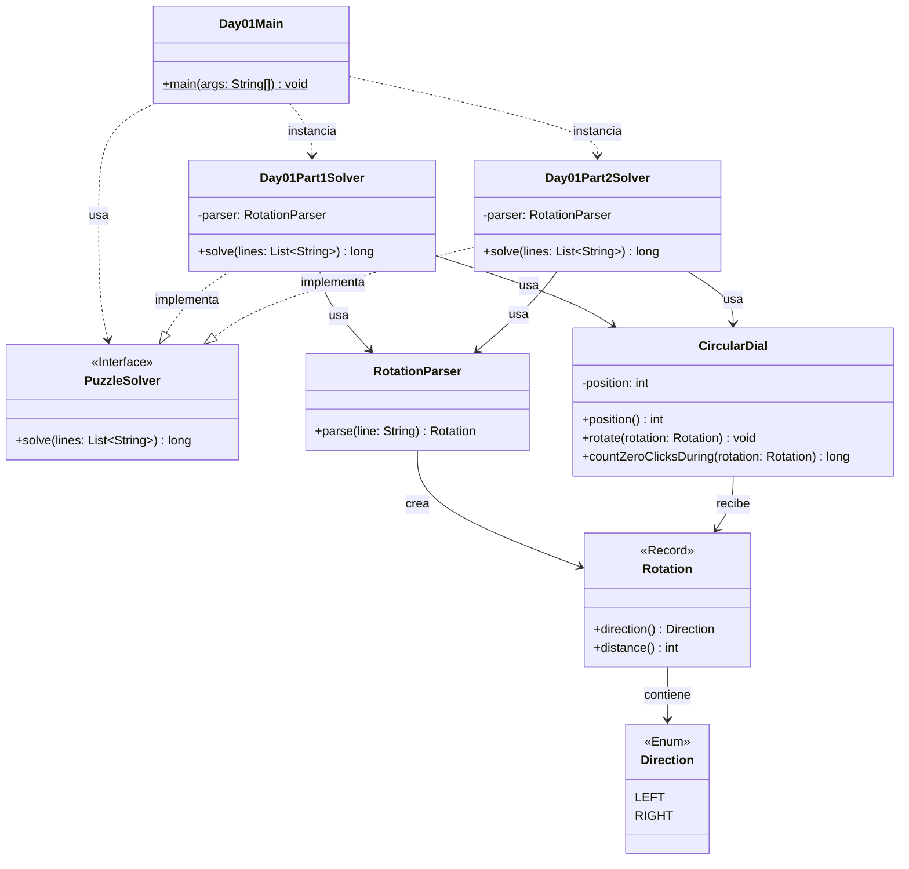

# Advent of Code 2025 - Day 1: Secret Entrance

Este proyecto contiene la solución para el **Día 1** del Advent of Code 2025: **Secret Entrance**.

El problema consiste en descifrar la contraseña de una caja fuerte que funciona mediante un dial circular numerado del `0` al `99`. El dial comienza apuntando a la posición `50` y recibe una secuencia de rotaciones hacia la izquierda (`L`) o hacia la derecha (`R`).

Cada día de Advent of Code contiene dos partes. En este proyecto, ambas partes están separadas en solvers independientes, pero comparten las clases comunes que representan el dominio del problema.

---

## Descripción del problema

La entrada del problema contiene una lista de rotaciones, una por línea.

Ejemplo:

```text
L68
L30
R48
L5
R60
```

Cada instrucción tiene dos elementos:

* una dirección:

    * `L`: izquierda, hacia números menores;
    * `R`: derecha, hacia números mayores;
* una distancia, que indica cuántos clicks gira el dial.

Como el dial es circular:

* girar a la izquierda desde `0` lleva a `99`;
* girar a la derecha desde `99` lleva a `0`.

---

## Parte 1

En la primera parte se debe contar cuántas veces el dial **termina apuntando a `0`** después de completar una rotación.

Por ejemplo, si una rotación termina exactamente en la posición `0`, se incrementa el contador de la contraseña.

La respuesta conocida para el input real de la parte 1 es:

```text
964
```

---

## Parte 2

En la segunda parte cambia el criterio de conteo.

Ahora se debe contar cuántas veces **cualquier click individual** hace que el dial apunte a `0`, aunque ocurra durante una rotación y no necesariamente al final.

Por ejemplo, si el dial empieza en `50`, una única rotación:

```text
R1000
```

hace que el dial pase por `0` diez veces antes de volver a `50`.

La solución de la parte 2 no simula cada click individualmente. En su lugar, calcula matemáticamente cuántas veces se alcanza el `0` durante cada rotación.

---

## Diseño y arquitectura

La solución está organizada siguiendo una estructura modular:

```text
day01
├── Day01Main.java
├── common
├── part1
└── part2
```

El objetivo de esta estructura es separar claramente:

* el punto de entrada del día;
* las clases comunes del dominio;
* la solución de la parte 1;
* la solución de la parte 2.

De esta manera, cada parte puede evolucionar de forma independiente. Si una clase común necesitara modificarse de forma incompatible para la parte 2, debería crearse una versión específica dentro de `part2`, manteniendo intacta la solución de la parte 1.

---

## Principios aplicados

### Single Responsibility Principle, SRP

Cada clase tiene una única responsabilidad:

* `Day01Main`: ejecuta el día 1 y muestra los resultados.
* `Day01Part1Solver`: resuelve únicamente la parte 1.
* `Day01Part2Solver`: resuelve únicamente la parte 2.
* `RotationParser`: transforma una línea del input en una rotación.
* `Rotation`: representa una instrucción de giro.
* `Direction`: representa la dirección de una rotación.
* `CircularDial`: encapsula la lógica del dial circular.
* `PuzzleSolver`: define el contrato común de los solvers.

Esta separación permite que cada clase tenga una razón clara para existir y una única razón principal para cambiar.

---

### Open/Closed Principle, OCP

El proyecto está preparado para ser extendido sin modificar el código existente.

Por ejemplo, para añadir el día 2 se puede crear una estructura paralela:

```text
day02
├── Day02Main.java
├── common
├── part1
└── part2
```

Así, el código del día 1 no necesita modificarse al añadir nuevos días.

También se puede añadir una nueva implementación de `PuzzleSolver` sin cambiar la interfaz común.

---

### Dependency Inversion Principle, DIP

Los solvers se utilizan a través de la abstracción `PuzzleSolver`.

Ejemplo:

```java
PuzzleSolver part1Solver = new Day01Part1Solver();
PuzzleSolver part2Solver = new Day01Part2Solver();
```

Esto permite que el código que ejecuta los solvers no dependa directamente de los detalles internos de cada implementación.

---

### DRY

La lógica común del día 1 se encuentra en el paquete:

```text
es.ulpgc.aoc2025.day01.common
```

En este paquete se colocan las clases que son compartidas por ambas partes:

* `CircularDial`
* `Direction`
* `Rotation`
* `RotationParser`

De esta forma se evita duplicar código entre la parte 1 y la parte 2.

---

### Código expresivo

El código intenta representar directamente los conceptos del problema.

Por ejemplo, en lugar de trabajar únicamente con caracteres sueltos como `'L'` o `'R'`, se utiliza el enum `Direction`.

También se utiliza un `record` para representar una rotación, ya que una rotación es simplemente un dato inmutable formado por una dirección y una distancia.

---

## Estructura del proyecto

```text
src
├── main
│   ├── java
│   │   └── es
│   │       └── ulpgc
│   │           └── aoc2025
│   │               ├── common
│   │               │   └── PuzzleSolver.java
│   │               │
│   │               └── day01
│   │                   ├── Day01Main.java
│   │                   │
│   │                   ├── common
│   │                   │   ├── CircularDial.java
│   │                   │   ├── Direction.java
│   │                   │   ├── Rotation.java
│   │                   │   └── RotationParser.java
│   │                   │
│   │                   ├── part1
│   │                   │   └── Day01Part1Solver.java
│   │                   │
│   │                   └── part2
│   │                       └── Day01Part2Solver.java
│   │
│   └── resources
│       └── day01
│           └── input.txt
│
└── test
    └── java
        └── es
            └── ulpgc
                └── aoc2025
                    └── day01
                        ├── part1
                        │   └── Day01Part1SolverTest.java
                        └── part2
                            └── Day01Part2SolverTest.java
```

---

## Paquetes principales

### `es.ulpgc.aoc2025.common`

Contiene código común al proyecto completo.

Actualmente contiene:

```text
PuzzleSolver.java
```

Esta interfaz define el contrato que deben cumplir todos los solvers:

```java
long solve(List<String> lines);
```

---

### `es.ulpgc.aoc2025.day01`

Contiene el punto de entrada específico del día 1:

```text
Day01Main.java
```

Esta clase se encarga de:

1. leer el archivo de entrada;
2. crear el solver de la parte 1;
3. crear el solver de la parte 2;
4. ejecutar ambos solvers;
5. mostrar los resultados por consola.

---

### `es.ulpgc.aoc2025.day01.common`

Contiene las clases comunes del dominio del día 1.

Estas clases son compartidas por la parte 1 y la parte 2 porque representan conceptos comunes del problema.

---

## Clases principales

### `Direction`

Representa la dirección de una rotación.

```java
public enum Direction {
    LEFT,
    RIGHT
}
```

Se usa un `enum` porque las direcciones posibles son cerradas y conocidas: izquierda o derecha.

---

### `Rotation`

Representa una instrucción de giro del dial.

Se ha implementado como `record` porque es un objeto de datos inmutable.

```java
package es.ulpgc.aoc2025.day01.common;

public record Rotation(Direction direction, int distance) {

    public Rotation {
        if (direction == null) {
            throw new IllegalArgumentException("Direction cannot be null");
        }
        if (distance < 0) {
            throw new IllegalArgumentException("Distance cannot be negative");
        }
    }
}
```

Una rotación contiene:

* `direction`: dirección del giro;
* `distance`: número de clicks.

El uso de `record` aporta varias ventajas:

* genera automáticamente los métodos `direction()` y `distance()`;
* genera automáticamente `equals()`, `hashCode()` y `toString()`;
* expresa que la clase representa datos inmutables;
* reduce código repetitivo;
* mejora la legibilidad.

Además, el constructor compacto valida que:

* la dirección no sea `null`;
* la distancia no sea negativa.

---

### `RotationParser`

Convierte una línea del input en una instancia de `Rotation`.

Ejemplo:

```text
L68
```

se convierte en:

```java
new Rotation(Direction.LEFT, 68)
```

Su responsabilidad es únicamente interpretar el formato textual de entrada.

---

### `CircularDial`

Representa el dial circular de la caja fuerte.

Sus responsabilidades son:

* almacenar la posición actual;
* aplicar una rotación;
* calcular cuántas veces se alcanza el `0` durante una rotación.

Esta clase encapsula la lógica del dominio principal del problema.

---

### `Day01Part1Solver`

Resuelve la primera parte del problema.

Su algoritmo es:

1. crear el dial en la posición inicial `50`;
2. leer cada instrucción;
3. convertirla en una rotación;
4. aplicar la rotación al dial;
5. comprobar si la posición final es `0`;
6. incrementar la contraseña si corresponde.

Esta parte solo tiene en cuenta la posición final después de cada rotación.

---

### `Day01Part2Solver`

Resuelve la segunda parte del problema.

Su algoritmo es:

1. crear el dial en la posición inicial `50`;
2. leer cada instrucción;
3. convertirla en una rotación;
4. calcular cuántas veces se alcanza el `0` durante esa rotación;
5. acumular ese valor en la contraseña.

Esta parte cuenta todos los pasos por `0`, incluso si ocurren durante una rotación.

---

## Diagrama de arquitectura



---

## Entrada del programa

El archivo de entrada debe colocarse en:

```text
src/main/resources/day01/input.txt
```

Cada línea debe tener el siguiente formato:

```text
L68
R48
L5
R1000
```

---

## Ejecución en IntelliJ IDEA

Para ejecutar el día 1:

1. abrir el archivo:

```text
src/main/java/es/ulpgc/aoc2025/day01/Day01Main.java
```

2. pulsar el botón verde junto al método `main`;

3. seleccionar:

```text
Run 'Day01Main.main()'
```

La salida tendrá un formato similar a:

```text
Day 01 - Part 1: 964
Day 01 - Part 2: <resultado_parte_2>
```

---

## Ejecución con Maven

Para ejecutar los tests:

```bash
mvn test
```

---

## Tests

El proyecto incluye tests separados para cada parte:

```text
Day01Part1SolverTest.java
Day01Part2SolverTest.java
```

Los tests comprueban el ejemplo oficial:

```text
L68
L30
R48
L5
R60
L55
L1
L99
R14
L82
```

Resultados esperados:

```text
Parte 1: 3
Parte 2: 6
```

También es recomendable probar el caso especial de la parte 2:

```text
R1000
```

Desde la posición inicial `50`, el dial apunta a `0` diez veces durante la rotación.

---

## Convención para próximos días

Para mantener el proyecto ordenado, cada día seguirá la misma estructura:

```text
dayXX
├── DayXXMain.java
├── common
├── part1
└── part2
```

Ejemplo para el día 2:

```text
day02
├── Day02Main.java
├── common
├── part1
└── part2
```

De esta forma, cada día queda aislado y se evita mezclar soluciones de problemas distintos.

---

## Conclusión

La solución del día 1 está diseñada para ser clara, mantenible y extensible.

La separación entre `common`, `part1` y `part2` permite reutilizar código cuando tiene sentido, sin acoplar innecesariamente las soluciones de ambas partes.

El uso de `Rotation` como `record` mejora la expresividad del dominio, ya que representa una instrucción inmutable compuesta únicamente por una dirección y una distancia.

Esta organización permite continuar el Advent of Code añadiendo nuevos días sin romper ni modificar las soluciones anteriores.
