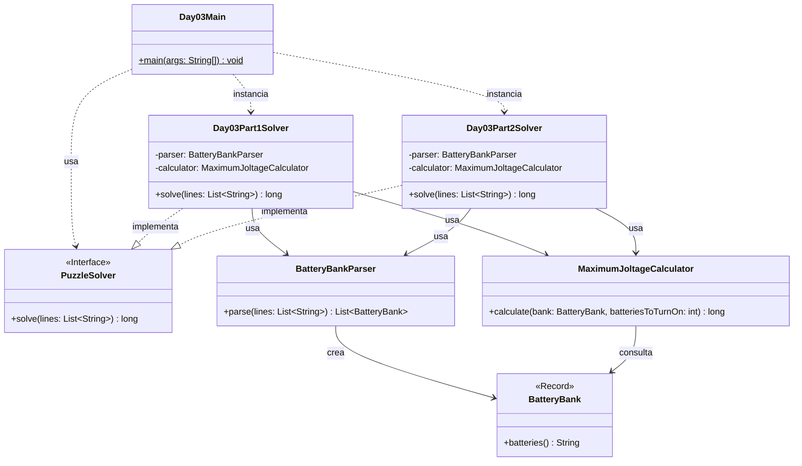

# Advent of Code 2025 - Day 3: Lobby

Este proyecto contiene la solución para el **Día 3** del Advent of Code 2025: **Lobby**.

El problema consiste en calcular la mayor salida de voltaje posible a partir de distintos bancos de baterías. Cada línea del input representa un banco de baterías, y cada dígito representa la potencia de una batería individual.

El día está dividido en dos partes:

* **Parte 1**: hay que encender exactamente **2 baterías** de cada banco.
* **Parte 2**: hay que encender exactamente **12 baterías** de cada banco.

En ambos casos, las baterías no pueden reordenarse. El voltaje producido por un banco es el número formado por los dígitos de las baterías seleccionadas, manteniendo su orden original.

---

## Descripción del problema

La entrada contiene varios bancos de baterías, uno por línea.

Ejemplo:

```text
987654321111111
811111111111119
234234234234278
818181911112111
```

Cada línea representa un banco. Por ejemplo:

```text
12345
```

Si se encienden las baterías `2` y `4`, el banco produce:

```text
24
```

No está permitido reordenar las baterías. Por tanto, en `12345` se puede formar `24`, pero no `42`.

---

## Parte 1

En la primera parte se debe elegir exactamente **2 baterías** de cada banco para formar el mayor número posible.

Ejemplo:

```text
987654321111111
```

La mejor elección es:

```text
98
```

porque son los dos primeros dígitos y forman el mayor número posible respetando el orden.

Con el ejemplo oficial completo:

```text
987654321111111
811111111111119
234234234234278
818181911112111
```

Los mayores voltajes son:

```text
98
89
78
92
```

La suma total es:

```text
357
```

Con el input real del usuario, el resultado de la parte 1 es:

```text
16812
```

---

## Parte 2

En la segunda parte se debe elegir exactamente **12 baterías** de cada banco.

El voltaje producido sigue siendo el número formado por las baterías seleccionadas, pero ahora tendrá 12 dígitos.

Ejemplo:

```text
987654321111111
```

El mayor voltaje posible es:

```text
987654321111
```

Con el ejemplo oficial completo:

```text
987654321111111
811111111111119
234234234234278
818181911112111
```

Los mayores voltajes son:

```text
987654321111
811111111119
434234234278
888911112111
```

La suma total es:

```text
3121910778619
```

Con el input real del usuario, el resultado de la parte 2 es:

```text
166345822896410
```

---

## Diseño y arquitectura

La solución mantiene la misma estructura modular usada en los días anteriores:

```text
day03
├── Day03Main.java
├── common
├── part1
└── part2
```

El objetivo es separar claramente:

* el punto de entrada del día;
* las clases comunes del dominio;
* la solución específica de la parte 1;
* la solución específica de la parte 2.

La lógica de cálculo del mayor voltaje se coloca en `common` porque sirve para ambas partes. La diferencia entre las partes no está en el algoritmo, sino en la cantidad de baterías que deben encenderse.

```text
Parte 1 → elegir 2 baterías
Parte 2 → elegir 12 baterías
```

---

## Principios aplicados

### Single Responsibility Principle, SRP

Cada clase tiene una única responsabilidad:

* `Day03Main`: ejecuta el día 3 y muestra los resultados.
* `Day03Part1Solver`: resuelve únicamente la parte 1.
* `Day03Part2Solver`: resuelve únicamente la parte 2.
* `BatteryBank`: representa un banco de baterías.
* `BatteryBankParser`: convierte el input textual en bancos de baterías.
* `MaximumJoltageCalculator`: calcula el mayor voltaje posible seleccionando un número concreto de baterías.
* `PuzzleSolver`: define el contrato común de los solvers.

Esta separación permite que cada clase sea fácil de entender, probar y modificar.

---

### Open/Closed Principle, OCP

El diseño permite extender el comportamiento sin modificar el código existente.

Por ejemplo, si en una futura parte se pidiera elegir otra cantidad de baterías, no sería necesario crear un algoritmo nuevo. Bastaría con reutilizar:

```java
calculator.calculate(bank, batteriesToTurnOn);
```

cambiando el valor de `batteriesToTurnOn`.

---

### Dependency Inversion Principle, DIP

Los solvers implementan la interfaz común:

```java
PuzzleSolver
```

Esto permite tratar todas las soluciones del proyecto de forma uniforme.

Ejemplo:

```java
PuzzleSolver part1Solver = new Day03Part1Solver();
PuzzleSolver part2Solver = new Day03Part2Solver();
```

El código cliente no necesita conocer los detalles internos de cada solver.

---

### DRY

La lógica común se reutiliza en el paquete:

```text
es.ulpgc.aoc2025.day03.common
```

En este paquete se encuentran las clases compartidas por ambas partes:

* `BatteryBank`
* `BatteryBankParser`
* `MaximumJoltageCalculator`

Así se evita duplicar el algoritmo de cálculo entre `part1` y `part2`.

---

### Código expresivo

El código intenta representar directamente los conceptos del problema.

Por ejemplo:

* `BatteryBank` representa un banco de baterías.
* `MaximumJoltageCalculator` expresa claramente la responsabilidad de calcular el mayor voltaje.
* `Day03Part1Solver` y `Day03Part2Solver` indican explícitamente qué parte resuelve cada clase.

---

## Estructura del proyecto

```text
src
├── main
│   ├── java
│   │   └── es
│   │       └── ulpgc
│   │           └── aoc2025
│   │               ├── common
│   │               │   └── PuzzleSolver.java
│   │               │
│   │               └── day03
│   │                   ├── Day03Main.java
│   │                   │
│   │                   ├── common
│   │                   │   ├── BatteryBank.java
│   │                   │   ├── BatteryBankParser.java
│   │                   │   └── MaximumJoltageCalculator.java
│   │                   │
│   │                   ├── part1
│   │                   │   └── Day03Part1Solver.java
│   │                   │
│   │                   └── part2
│   │                       └── Day03Part2Solver.java
│   │
│   └── resources
│       └── day03
│           └── input.txt
│
└── test
    └── java
        └── es
            └── ulpgc
                └── aoc2025
                    └── day03
                        ├── part1
                        │   └── Day03Part1SolverTest.java
                        └── part2
                            └── Day03Part2SolverTest.java
```

---

## Paquetes principales

### `es.ulpgc.aoc2025.common`

Contiene código común a todo el proyecto Advent of Code.

Actualmente contiene:

```text
PuzzleSolver.java
```

Esta interfaz define el contrato general que deben cumplir todos los solvers:

```java
long solve(List<String> lines);
```

---

### `es.ulpgc.aoc2025.day03`

Contiene el punto de entrada específico del día 3:

```text
Day03Main.java
```

Esta clase se encarga de:

1. leer el archivo de entrada;
2. crear el solver de la parte 1;
3. crear el solver de la parte 2;
4. ejecutar ambos solvers;
5. mostrar los resultados por consola.

---

### `es.ulpgc.aoc2025.day03.common`

Contiene las clases comunes del dominio del día 3.

Estas clases son compartidas por la parte 1 y la parte 2 porque representan conceptos comunes del problema.

---

## Clases principales

### `BatteryBank`

Representa un banco de baterías.

Se puede implementar como `record`, ya que es un objeto de datos inmutable compuesto por una única secuencia de dígitos.

```java
package es.ulpgc.aoc2025.day03.common;

public record BatteryBank(String batteries) {

    public BatteryBank {
        if (batteries == null) {
            throw new IllegalArgumentException("Batteries cannot be null");
        }

        if (batteries.length() < 2) {
            throw new IllegalArgumentException("A battery bank must contain at least two batteries");
        }

        if (!batteries.matches("[1-9]+")) {
            throw new IllegalArgumentException("A battery bank can only contain digits from 1 to 9");
        }
    }
}
```

El uso de `record` aporta varias ventajas:

* expresa que el banco es un dato inmutable;
* genera automáticamente el método `batteries()`;
* genera automáticamente `equals()`, `hashCode()` y `toString()`;
* reduce código repetitivo;
* permite añadir validación en el constructor compacto.

---

### `BatteryBankParser`

Convierte las líneas del input en una lista de bancos de baterías.

Ejemplo:

```text
987654321111111
811111111111119
```

se transforma en una lista de objetos `BatteryBank`.

Su responsabilidad es únicamente interpretar el formato de entrada.

---

### `MaximumJoltageCalculator`

Calcula el mayor voltaje posible para un banco, seleccionando una cantidad concreta de baterías.

Su método principal es:

```java
long calculate(BatteryBank bank, int batteriesToTurnOn);
```

La misma clase sirve tanto para la parte 1 como para la parte 2:

```text
Parte 1 → batteriesToTurnOn = 2
Parte 2 → batteriesToTurnOn = 12
```

El algoritmo selecciona la mayor subsecuencia posible de una longitud determinada.

---

## Estrategia de cálculo

El problema puede verse como:

> Dada una cadena de dígitos, obtener la mayor subsecuencia posible de longitud `N`.

Una solución de fuerza bruta consistiría en probar todas las combinaciones de baterías posibles. Sin embargo, esto no escala bien, especialmente en la parte 2, donde hay que elegir 12 baterías.

La solución usada aplica una estrategia voraz:

1. se recorren los dígitos de izquierda a derecha;
2. se mantiene una secuencia seleccionada;
3. si aparece un dígito mayor que el último seleccionado y todavía se pueden descartar baterías, se elimina el dígito anterior;
4. al final se conserva únicamente la longitud necesaria.

Ejemplo simplificado:

```text
818181911112111
```

Para elegir 12 baterías, el algoritmo descarta algunos `1` iniciales y conserva una secuencia máxima:

```text
888911112111
```

Este enfoque evita probar todas las combinaciones posibles.

---

### `Day03Part1Solver`

Resuelve la primera parte del problema.

Su algoritmo es:

1. parsear el input para obtener los bancos;
2. para cada banco, calcular el mayor voltaje eligiendo 2 baterías;
3. sumar todos los voltajes.

---

### `Day03Part2Solver`

Resuelve la segunda parte del problema.

Su algoritmo es:

1. parsear el input para obtener los bancos;
2. para cada banco, calcular el mayor voltaje eligiendo 12 baterías;
3. sumar todos los voltajes.

---

## Diagrama de arquitectura



---

## Entrada del programa

El archivo de entrada debe colocarse en:

```text
src/main/resources/day03/input.txt
```

El contenido debe tener un banco de baterías por línea:

```text
987654321111111
811111111111119
234234234234278
818181911112111
```

---

## Ejecución en IntelliJ IDEA

Para ejecutar el día 3:

1. abrir el archivo:

```text
src/main/java/es/ulpgc/aoc2025/day03/Day03Main.java
```

2. pulsar el botón verde junto al método `main`;

3. seleccionar:

```text
Run 'Day03Main.main()'
```

La salida tendrá este formato:

```text
Day 03 - Part 1: 16812
Day 03 - Part 2: 166345822896410
```

---

## Ejecución con Maven

Para ejecutar los tests:

```bash
mvn test
```

---

## Tests

El proyecto incluye tests separados para cada parte:

```text
Day03Part1SolverTest.java
Day03Part2SolverTest.java
```

Los tests comprueban el ejemplo oficial:

```text
987654321111111
811111111111119
234234234234278
818181911112111
```

Resultado esperado para la parte 1:

```text
357
```

Resultado esperado para la parte 2:

```text
3121910778619
```

---

## Convención para próximos días

Cada día del Advent of Code seguirá la misma estructura:

```text
dayXX
├── DayXXMain.java
├── common
├── part1
└── part2
```

Ejemplo para el día 4:

```text
day04
├── Day04Main.java
├── common
├── part1
└── part2
```

De esta forma, cada día queda aislado y se evita mezclar soluciones de problemas distintos.

---

## Conclusión

La solución del día 3 está organizada para mantener una separación clara entre el dominio común y las diferencias específicas de cada parte.

La clase `MaximumJoltageCalculator` permite reutilizar el mismo algoritmo para seleccionar la mayor subsecuencia posible, cambiando únicamente el número de baterías que deben encenderse.

Esta estructura evita duplicación, mejora la mantenibilidad y permite añadir nuevas partes o nuevos días sin romper las soluciones anteriores.
