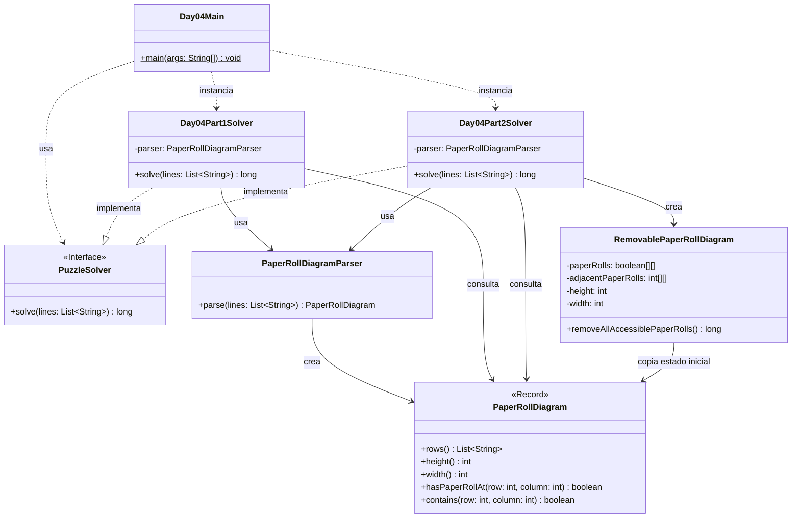

# Advent of Code 2025 - Day 4: Printing Department

Este proyecto contiene la solución para el **Día 4** del Advent of Code 2025: **Printing Department**.

El problema consiste en analizar un diagrama formado por rollos de papel colocados en una cuadrícula. Cada rollo está representado por el carácter `@`, mientras que los espacios vacíos están representados por `.`.

El día está dividido en dos partes:

* **Parte 1**: contar cuántos rollos de papel pueden ser accedidos inicialmente por una carretilla.
* **Parte 2**: simular la eliminación progresiva de rollos accesibles hasta que no se pueda eliminar ninguno más.

---

## Descripción del problema

La entrada del problema es una cuadrícula de caracteres.

Ejemplo:

```text
..@@.@@@@.
@@@.@.@.@@
@@@@@.@.@@
@.@@@@..@.
@@.@@@@.@@
.@@@@@@@.@
.@.@.@.@@@
@.@@@.@@@@
.@@@@@@@@.
@.@.@@@.@.
```

Cada celda puede contener:

```text
@ → rollo de papel
. → espacio vacío
```

Para cada rollo de papel, se consideran sus 8 posiciones adyacentes:

```text
↖ ↑ ↗
← @ →
↙ ↓ ↘
```

Un rollo puede ser accedido por una carretilla si tiene **menos de 4 rollos de papel adyacentes**.

---

## Parte 1

En la primera parte solo se analiza el estado inicial del diagrama.

Un rollo de papel es accesible si:

```text
número de rollos adyacentes < 4
```

Con el ejemplo oficial, hay:

```text
13
```

rollos accesibles.

Con el input real del usuario, el resultado de la parte 1 es:

```text
1489
```

---

## Parte 2

En la segunda parte, cuando un rollo de papel es accesible, puede eliminarse.

Al eliminar un rollo, cambian las condiciones de accesibilidad de los rollos vecinos. Por tanto, nuevos rollos pueden volverse accesibles después de cada eliminación.

El proceso se repite hasta que no queda ningún rollo accesible.

Con el ejemplo oficial, el total de rollos eliminados es:

```text
43
```

Con el input real del usuario, el resultado de la parte 2 es:

```text
8890
```

---

## Diseño y arquitectura

La solución mantiene la estructura modular utilizada en los días anteriores:

```text
day04
├── Day04Main.java
├── common
├── part1
└── part2
```

El objetivo es separar claramente:

* el punto de entrada del día;
* el modelo común del problema;
* la lógica específica de la parte 1;
* la lógica específica de la parte 2.

En este día es importante distinguir entre:

```text
PaperRollDiagram              → modelo común e inmutable
RemovablePaperRollDiagram     → modelo mutable específico de la parte 2
```

La clase `PaperRollDiagram` representa el diagrama original. No se modifica durante la ejecución.

La clase `RemovablePaperRollDiagram` se crea específicamente para la parte 2 porque esta parte necesita simular eliminaciones. Convertir `PaperRollDiagram` en mutable afectaría al diseño común y podría introducir efectos secundarios innecesarios en la parte 1.

Por tanto, siguiendo la regla establecida en el proyecto:

> Si una clase común necesita una modificación grande para una parte nueva, se crea una clase específica para esa parte.

---

## Principios aplicados

### Single Responsibility Principle, SRP

Cada clase tiene una única responsabilidad:

* `Day04Main`: ejecuta el día 4 y muestra los resultados.
* `PaperRollDiagram`: representa el diagrama original de rollos de papel.
* `PaperRollDiagramParser`: convierte las líneas del input en un diagrama.
* `Day04Part1Solver`: resuelve únicamente la parte 1.
* `Day04Part2Solver`: resuelve únicamente la parte 2.
* `RemovablePaperRollDiagram`: simula la eliminación progresiva de rollos para la parte 2.

Esta separación permite entender, probar y modificar cada pieza de forma aislada.

---

### Open/Closed Principle, OCP

La parte 2 se añade sin modificar la lógica de la parte 1.

La clase común `PaperRollDiagram` sigue representando el estado original del mapa. Para la nueva lógica mutable, se crea una clase específica:

```text
day04/part2/RemovablePaperRollDiagram.java
```

De esta forma, el código existente queda cerrado a modificaciones innecesarias, pero el sistema sigue abierto a extensión.

---

### Dependency Inversion Principle, DIP

Los solvers implementan la interfaz común:

```java
PuzzleSolver
```

Esto permite ejecutarlos de manera uniforme:

```java
PuzzleSolver part1Solver = new Day04Part1Solver();
PuzzleSolver part2Solver = new Day04Part2Solver();
```

El `Main` no necesita conocer los detalles internos de cada solver.

---

### DRY

La lógica común del día 4 se mantiene en:

```text
es.ulpgc.aoc2025.day04.common
```

Aquí se encuentran:

* `PaperRollDiagram`
* `PaperRollDiagramParser`

Estas clases se reutilizan tanto en la parte 1 como en la parte 2.

La parte 2 solo añade lo necesario para simular eliminaciones, sin duplicar el parser ni la representación inicial del diagrama.

---

### Código expresivo

El código intenta representar directamente los conceptos del problema.

Por ejemplo:

* `PaperRollDiagram` representa el diagrama de rollos de papel.
* `hasPaperRollAt` indica si hay un rollo en una posición.
* `RemovablePaperRollDiagram` representa una versión mutable del diagrama para la simulación.
* `removeAllAccessiblePaperRolls` expresa claramente el objetivo de la parte 2.

---

## Estructura del proyecto

```text
src
├── main
│   ├── java
│   │   └── es
│   │       └── ulpgc
│   │           └── aoc2025
│   │               ├── common
│   │               │   └── PuzzleSolver.java
│   │               │
│   │               └── day04
│   │                   ├── Day04Main.java
│   │                   │
│   │                   ├── common
│   │                   │   ├── PaperRollDiagram.java
│   │                   │   └── PaperRollDiagramParser.java
│   │                   │
│   │                   ├── part1
│   │                   │   └── Day04Part1Solver.java
│   │                   │
│   │                   └── part2
│   │                       ├── Day04Part2Solver.java
│   │                       └── RemovablePaperRollDiagram.java
│   │
│   └── resources
│       └── day04
│           └── input.txt
│
└── test
    └── java
        └── es
            └── ulpgc
                └── aoc2025
                    └── day04
                        ├── part1
                        │   └── Day04Part1SolverTest.java
                        └── part2
                            └── Day04Part2SolverTest.java
```

---

## Paquetes principales

### `es.ulpgc.aoc2025.common`

Contiene código común al proyecto Advent of Code.

Actualmente contiene:

```text
PuzzleSolver.java
```

Esta interfaz define el contrato general que deben cumplir los solvers:

```java
long solve(List<String> lines);
```

---

### `es.ulpgc.aoc2025.day04`

Contiene el punto de entrada específico del día 4:

```text
Day04Main.java
```

Esta clase se encarga de:

1. leer el archivo de entrada;
2. crear el solver de la parte 1;
3. crear el solver de la parte 2;
4. ejecutar ambos solvers;
5. mostrar los resultados por consola.

---

### `es.ulpgc.aoc2025.day04.common`

Contiene las clases comunes del dominio del día 4.

Estas clases representan el input original y pueden reutilizarse en ambas partes.

---

### `es.ulpgc.aoc2025.day04.part1`

Contiene la solución específica de la parte 1.

---

### `es.ulpgc.aoc2025.day04.part2`

Contiene la solución específica de la parte 2.

Aquí se encuentra la clase mutable `RemovablePaperRollDiagram`, necesaria para simular la eliminación de rollos.

---

## Clases principales

### `PaperRollDiagram`

Representa el diagrama original de rollos de papel.

Se puede implementar como `record` porque representa un dato inmutable: una lista de filas.

```java
package es.ulpgc.aoc2025.day04.common;

import java.util.List;

public record PaperRollDiagram(List<String> rows) {

    public PaperRollDiagram {
        if (rows == null) {
            throw new IllegalArgumentException("Rows cannot be null");
        }

        if (rows.isEmpty()) {
            throw new IllegalArgumentException("Rows cannot be empty");
        }

        int width = rows.getFirst().length();

        for (String row : rows) {
            if (row == null) {
                throw new IllegalArgumentException("Row cannot be null");
            }

            if (row.length() != width) {
                throw new IllegalArgumentException("All rows must have the same width");
            }

            if (!row.matches("[.@]+")) {
                throw new IllegalArgumentException("Rows can only contain '.' and '@'");
            }
        }

        rows = List.copyOf(rows);
    }

    public int height() {
        return rows.size();
    }

    public int width() {
        return rows.getFirst().length();
    }

    public boolean hasPaperRollAt(int row, int column) {
        return rows.get(row).charAt(column) == '@';
    }

    public boolean contains(int row, int column) {
        return 0 <= row && row < height()
                && 0 <= column && column < width();
    }
}
```

Responsabilidades:

* almacenar las filas del diagrama;
* validar el formato del mapa;
* indicar si una posición contiene un rollo de papel;
* comprobar si una posición está dentro de la cuadrícula.

---

### `PaperRollDiagramParser`

Convierte las líneas del input en un `PaperRollDiagram`.

```java
package es.ulpgc.aoc2025.day04.common;

import java.util.ArrayList;
import java.util.List;

public class PaperRollDiagramParser {

    public PaperRollDiagram parse(List<String> lines) {
        List<String> rows = new ArrayList<>();

        for (String line : lines) {
            if (line.isBlank()) {
                continue;
            }

            rows.add(line.trim());
        }

        return new PaperRollDiagram(rows);
    }
}
```

Esta clase no conoce las reglas de accesibilidad. Su única responsabilidad es parsear el input.

---

### `Day04Part1Solver`

Resuelve la primera parte del problema.

Su algoritmo es:

1. parsear el diagrama;
2. recorrer todas las posiciones;
3. localizar las posiciones con `@`;
4. contar los rollos adyacentes;
5. sumar aquellos que tengan menos de 4 vecinos.

---

### `RemovablePaperRollDiagram`

Representa una versión mutable del diagrama para la parte 2.

Esta clase se coloca en `part2` porque su comportamiento no es común a ambas partes.

Responsabilidades:

* copiar el estado inicial desde `PaperRollDiagram`;
* mantener una matriz mutable de rollos;
* mantener el número de vecinos de cada posición;
* eliminar rollos accesibles;
* actualizar la accesibilidad de los vecinos;
* devolver el total de rollos eliminados.

La idea principal es no recalcular todo el mapa desde cero en cada iteración. En su lugar, cuando se elimina un rollo, solo se actualizan los vecinos afectados.

---

### `Day04Part2Solver`

Resuelve la segunda parte del problema.

Su algoritmo es:

1. parsear el diagrama original;
2. crear un `RemovablePaperRollDiagram`;
3. eliminar todos los rollos accesibles de forma progresiva;
4. devolver el total de rollos eliminados.

---

## Estrategia de resolución

### Parte 1

La parte 1 es un análisis estático del mapa.

Para cada rollo `@`, se cuentan sus vecinos:

```text
↖ ↑ ↗
← @ →
↙ ↓ ↘
```

Si el número de vecinos es menor que `4`, el rollo se considera accesible.

---

### Parte 2

La parte 2 es una simulación dinámica.

El proceso es:

1. encontrar los rollos inicialmente accesibles;
2. eliminarlos;
3. actualizar los vecinos de cada rollo eliminado;
4. añadir a la cola los nuevos rollos que se vuelvan accesibles;
5. repetir hasta que la cola quede vacía.

Para evitar procesar posiciones inválidas, antes de eliminar un rollo se comprueba:

* que todavía exista;
* que siga siendo accesible.

Esto es importante porque una misma posición puede añadirse varias veces a la cola durante la simulación.

---

## Diagrama de arquitectura



---

## Entrada del programa

El archivo de entrada debe colocarse en:

```text
src/main/resources/day04/input.txt
```

El contenido debe tener una cuadrícula formada únicamente por `.` y `@`.

Ejemplo:

```text
..@@.@@@@.
@@@.@.@.@@
@@@@@.@.@@
@.@@@@..@.
@@.@@@@.@@
.@@@@@@@.@
.@.@.@.@@@
@.@@@.@@@@
.@@@@@@@@.
@.@.@@@.@.
```

---

## Ejecución en IntelliJ IDEA

Para ejecutar el día 4:

1. abrir el archivo:

```text
src/main/java/es/ulpgc/aoc2025/day04/Day04Main.java
```

2. pulsar el botón verde junto al método `main`;

3. seleccionar:

```text
Run 'Day04Main.main()'
```

La salida tendrá este formato:

```text
Day 04 - Part 1: 1489
Day 04 - Part 2: 8890
```

---

## Ejecución con Maven

Para ejecutar los tests:

```bash
mvn test
```

---

## Tests

El proyecto incluye tests separados para cada parte:

```text
Day04Part1SolverTest.java
Day04Part2SolverTest.java
```

Los tests usan el ejemplo oficial:

```text
..@@.@@@@.
@@@.@.@.@@
@@@@@.@.@@
@.@@@@..@.
@@.@@@@.@@
.@@@@@@@.@
.@.@.@.@@@
@.@@@.@@@@
.@@@@@@@@.
@.@.@@@.@.
```

Resultado esperado para la parte 1:

```text
13
```

Resultado esperado para la parte 2:

```text
43
```

---

## Convención para próximos días

Cada día del Advent of Code seguirá la misma estructura:

```text
dayXX
├── DayXXMain.java
├── common
├── part1
└── part2
```

Ejemplo para el día 5:

```text
day05
├── Day05Main.java
├── common
├── part1
└── part2
```

Cuando una clase pueda compartirse sin modificar su comportamiento, se coloca en `common`.

Cuando una parte requiera modificar mucho el comportamiento de una clase común, se crea una clase específica dentro de `part1` o `part2`.

---

## Conclusión

La solución del día 4 está organizada para mantener una separación clara entre el modelo común del problema y la simulación específica de la parte 2.

`PaperRollDiagram` permanece como una representación inmutable del mapa original, mientras que `RemovablePaperRollDiagram` encapsula la lógica mutable necesaria para eliminar rollos progresivamente.

Esta decisión evita efectos secundarios en la parte 1, mantiene bajo el acoplamiento y permite que el proyecto siga creciendo de forma ordenada en los próximos días.
