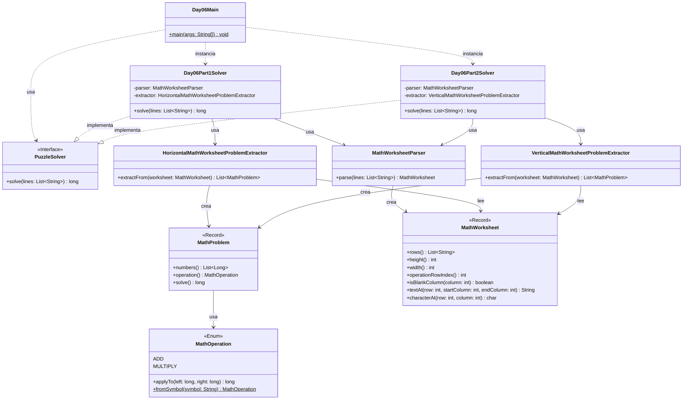

# Advent of Code 2025 - Day 6: Trash Compactor

Este proyecto contiene la solución para el **Día 6** del Advent of Code 2025: **Trash Compactor**.

El problema consiste en leer una hoja de ejercicios matemáticos escrita en un formato poco habitual. La hoja contiene varios problemas colocados horizontalmente, separados por columnas vacías. Cada problema contiene varios números y un operador al final, que puede ser suma (`+`) o multiplicación (`*`).

El día está dividido en dos partes:

* **Parte 1**: los números se leen horizontalmente, por filas.
* **Parte 2**: los números se leen verticalmente, por columnas, de derecha a izquierda.

---

## Descripción del problema

La entrada representa una hoja de ejercicios matemáticos.

Ejemplo:

```text
123 328  51 64 
 45 64  387 23 
  6 98  215 314
*   +   *   +  
```

Los problemas están colocados uno junto a otro. Cada problema termina con un operador en la última fila.

Los problemas están separados por una columna completa formada solo por espacios.

---

## Parte 1

En la primera parte, cada problema se lee de forma horizontal.

Con el ejemplo:

```text
123 328  51 64 
 45 64  387 23 
  6 98  215 314
*   +   *   +  
```

Los problemas son:

```text
123 * 45 * 6 = 33210
328 + 64 + 98 = 490
51 * 387 * 215 = 4243455
64 + 23 + 314 = 401
```

La suma total es:

```text
4277556
```

Con el input real del usuario, el resultado de la parte 1 es:

```text
5322004718681
```

---

## Parte 2

En la segunda parte, la forma de leer la hoja cambia.

Ahora los problemas se leen:

```text
de derecha a izquierda
por columnas
con el dígito más significativo arriba
y el dígito menos significativo abajo
```

Usando el mismo ejemplo:

```text
123 328  51 64 
 45 64  387 23 
  6 98  215 314
*   +   *   +  
```

Los problemas pasan a ser:

```text
4 + 431 + 623 = 1058
175 * 581 * 32 = 3253600
8 + 248 + 369 = 625
356 * 24 * 1 = 8544
```

La suma total es:

```text
3263827
```

Con el input real del usuario, el resultado de la parte 2 es:

```text
9876636978528
```

---

## Diseño y arquitectura

La solución mantiene la estructura modular usada en los días anteriores:

```text
day06
├── Day06Main.java
├── common
├── part1
└── part2
```

En este día es importante separar las clases comunes de las clases específicas de cada parte.

La parte 1 y la parte 2 comparten:

* la representación de la hoja;
* la representación de un problema matemático;
* la operación matemática;
* el parser base.

Sin embargo, **no comparten la forma de extraer los problemas**, porque cada parte interpreta la hoja de una manera distinta.

Por eso se crean dos extractores diferentes:

```text
HorizontalMathWorksheetProblemExtractor → específico de part1
VerticalMathWorksheetProblemExtractor   → específico de part2
```

Esto evita forzar una clase común a tener dos comportamientos incompatibles.

---

## Principios aplicados

### Single Responsibility Principle, SRP

Cada clase tiene una única responsabilidad:

* `Day06Main`: ejecuta el día 6 y muestra los resultados.
* `MathOperation`: representa la operación matemática.
* `MathProblem`: representa un problema matemático y sabe resolverlo.
* `MathWorksheet`: representa la hoja completa.
* `MathWorksheetParser`: convierte las líneas del input en una hoja normalizada.
* `HorizontalMathWorksheetProblemExtractor`: extrae problemas según la lectura horizontal de la parte 1.
* `VerticalMathWorksheetProblemExtractor`: extrae problemas según la lectura vertical de la parte 2.
* `Day06Part1Solver`: resuelve únicamente la parte 1.
* `Day06Part2Solver`: resuelve únicamente la parte 2.

---

### Open/Closed Principle, OCP

La parte 2 se añade sin modificar la lógica de la parte 1.

Como la interpretación de la hoja cambia bastante entre partes, se crea una nueva clase específica para la parte 2:

```text
VerticalMathWorksheetProblemExtractor
```

La parte 1 conserva su extractor horizontal:

```text
HorizontalMathWorksheetProblemExtractor
```

De esta forma, el código de la parte 1 queda cerrado a modificaciones innecesarias, pero el sistema sigue abierto a extensión.

---

### Dependency Inversion Principle, DIP

Los solvers implementan la interfaz común:

```java
PuzzleSolver
```

Esto permite ejecutarlos de forma uniforme desde el `Main`:

```java
PuzzleSolver part1Solver = new Day06Part1Solver();
PuzzleSolver part2Solver = new Day06Part2Solver();
```

El `Main` no necesita conocer los detalles internos de cómo se interpreta la hoja en cada parte.

---

### DRY

La lógica común se mantiene en el paquete:

```text
es.ulpgc.aoc2025.day06.common
```

Aquí se encuentran:

* `MathOperation`
* `MathProblem`
* `MathWorksheet`
* `MathWorksheetParser`

La lógica específica de lectura se separa en cada parte para evitar duplicar o mezclar responsabilidades.

---

### Código expresivo

Los nombres de las clases reflejan directamente el dominio del problema:

* `MathWorksheet`: hoja de ejercicios.
* `MathProblem`: problema matemático.
* `MathOperation`: operación matemática.
* `HorizontalMathWorksheetProblemExtractor`: extractor horizontal.
* `VerticalMathWorksheetProblemExtractor`: extractor vertical.

Esto hace que el diseño sea fácil de leer y mantener.

---

## Estructura del proyecto

```text
src
├── main
│   ├── java
│   │   └── es
│   │       └── ulpgc
│   │           └── aoc2025
│   │               ├── common
│   │               │   └── PuzzleSolver.java
│   │               │
│   │               └── day06
│   │                   ├── Day06Main.java
│   │                   │
│   │                   ├── common
│   │                   │   ├── MathOperation.java
│   │                   │   ├── MathProblem.java
│   │                   │   ├── MathWorksheet.java
│   │                   │   └── MathWorksheetParser.java
│   │                   │
│   │                   ├── part1
│   │                   │   ├── Day06Part1Solver.java
│   │                   │   └── HorizontalMathWorksheetProblemExtractor.java
│   │                   │
│   │                   └── part2
│   │                       ├── Day06Part2Solver.java
│   │                       └── VerticalMathWorksheetProblemExtractor.java
│   │
│   └── resources
│       └── day06
│           └── input.txt
│
└── test
    └── java
        └── es
            └── ulpgc
                └── aoc2025
                    └── day06
                        ├── part1
                        │   └── Day06Part1SolverTest.java
                        └── part2
                            └── Day06Part2SolverTest.java
```

---

## Paquetes principales

### `es.ulpgc.aoc2025.common`

Contiene código común a todo el proyecto Advent of Code.

Actualmente contiene:

```text
PuzzleSolver.java
```

Esta interfaz define el contrato general de todos los solvers:

```java
long solve(List<String> lines);
```

---

### `es.ulpgc.aoc2025.day06`

Contiene el punto de entrada específico del día 6:

```text
Day06Main.java
```

Esta clase se encarga de:

1. leer el archivo de entrada;
2. crear el solver de la parte 1;
3. crear el solver de la parte 2;
4. ejecutar ambos solvers;
5. mostrar los resultados por consola.

---

### `es.ulpgc.aoc2025.day06.common`

Contiene las clases comunes del dominio del día 6.

Estas clases no dependen de una parte concreta.

---

### `es.ulpgc.aoc2025.day06.part1`

Contiene la solución específica de la primera parte.

---

### `es.ulpgc.aoc2025.day06.part2`

Contiene la solución específica de la segunda parte.

---

## Clases principales

### `MathOperation`

Representa las operaciones posibles de la hoja:

```java
package es.ulpgc.aoc2025.day06.common;

public enum MathOperation {
    ADD,
    MULTIPLY;

    public long applyTo(long left, long right) {
        return switch (this) {
            case ADD -> left + right;
            case MULTIPLY -> left * right;
        };
    }

    public static MathOperation fromSymbol(String symbol) {
        return switch (symbol) {
            case "+" -> ADD;
            case "*" -> MULTIPLY;
            default -> throw new IllegalArgumentException("Invalid operation: " + symbol);
        };
    }
}
```

Responsabilidades:

* representar una suma;
* representar una multiplicación;
* aplicar la operación a dos valores;
* convertir un símbolo textual en una operación.

---

### `MathProblem`

Representa un problema matemático individual.

```java
package es.ulpgc.aoc2025.day06.common;

import java.util.List;

public record MathProblem(List<Long> numbers, MathOperation operation) {

    public MathProblem {
        if (numbers == null) {
            throw new IllegalArgumentException("Numbers cannot be null");
        }

        if (numbers.isEmpty()) {
            throw new IllegalArgumentException("A problem must contain at least one number");
        }

        if (operation == null) {
            throw new IllegalArgumentException("Operation cannot be null");
        }

        numbers = List.copyOf(numbers);
    }

    public long solve() {
        long result = numbers.get(0);

        for (int i = 1; i < numbers.size(); i++) {
            result = operation.applyTo(result, numbers.get(i));
        }

        return result;
    }
}
```

Responsabilidades:

* almacenar los números del problema;
* almacenar la operación;
* calcular el resultado del problema.

---

### `MathWorksheet`

Representa la hoja completa de ejercicios.

```java
package es.ulpgc.aoc2025.day06.common;

import java.util.List;

public record MathWorksheet(List<String> rows) {

    public MathWorksheet {
        if (rows == null) {
            throw new IllegalArgumentException("Rows cannot be null");
        }

        if (rows.size() < 2) {
            throw new IllegalArgumentException("A worksheet must contain number rows and an operation row");
        }

        int width = rows.get(0).length();

        for (String row : rows) {
            if (row == null) {
                throw new IllegalArgumentException("Row cannot be null");
            }

            if (row.length() != width) {
                throw new IllegalArgumentException("All rows must have the same width");
            }
        }

        rows = List.copyOf(rows);
    }

    public int height() {
        return rows.size();
    }

    public int width() {
        return rows.get(0).length();
    }

    public int operationRowIndex() {
        return height() - 1;
    }

    public boolean isBlankColumn(int column) {
        for (String row : rows) {
            if (row.charAt(column) != ' ') {
                return false;
            }
        }

        return true;
    }

    public String textAt(int row, int startColumn, int endColumn) {
        return rows.get(row).substring(startColumn, endColumn);
    }

    // Añadido para la parte 2.
    // Permite leer un carácter concreto de la hoja.
    public char characterAt(int row, int column) {
        return rows.get(row).charAt(column);
    }
}
```

Responsabilidades:

* almacenar las filas de la hoja;
* validar que todas las filas tengan la misma anchura;
* detectar columnas vacías;
* devolver fragmentos de texto;
* permitir leer caracteres concretos.

---

### `MathWorksheetParser`

Convierte las líneas del input en un `MathWorksheet`.

```java
package es.ulpgc.aoc2025.day06.common;

import java.util.ArrayList;
import java.util.List;

public class MathWorksheetParser {

    public MathWorksheet parse(List<String> lines) {
        List<String> rows = new ArrayList<>();

        for (String line : lines) {
            if (!line.isBlank()) {
                rows.add(line);
            }
        }

        // Añadido para Day 06.
        // Al copiar el input, algunas filas pueden perder espacios finales.
        // Como el problema depende de columnas, rellenamos todas las filas
        // hasta la anchura máxima usando espacios a la derecha.
        return new MathWorksheet(normalizeWidth(rows));
    }

    private List<String> normalizeWidth(List<String> rows) {
        int width = maxWidthOf(rows);
        List<String> normalizedRows = new ArrayList<>();

        for (String row : rows) {
            normalizedRows.add(padRight(row, width));
        }

        return normalizedRows;
    }

    private int maxWidthOf(List<String> rows) {
        int maxWidth = 0;

        for (String row : rows) {
            if (row.length() > maxWidth) {
                maxWidth = row.length();
            }
        }

        return maxWidth;
    }

    private String padRight(String text, int width) {
        return text + " ".repeat(width - text.length());
    }
}
```

Esta clase es especialmente importante en este día.

Como el input depende de columnas, los espacios forman parte del formato. Al copiar el input desde la web o guardarlo en el editor, pueden perderse espacios al final de algunas líneas.

Por eso el parser normaliza todas las filas para que tengan la misma anchura, rellenando con espacios a la derecha.

---

### `HorizontalMathWorksheetProblemExtractor`

Extrae los problemas usando la interpretación de la parte 1.

Ubicación:

```text
src/main/java/es/ulpgc/aoc2025/day06/part1/HorizontalMathWorksheetProblemExtractor.java
```

Responsabilidades:

* detectar los bloques separados por columnas vacías;
* leer cada número de forma horizontal;
* leer el operador del bloque;
* crear objetos `MathProblem`.

La parte 1 lee cada bloque así:

```text
por filas
de arriba hacia abajo
```

---

### `VerticalMathWorksheetProblemExtractor`

Extrae los problemas usando la interpretación de la parte 2.

Ubicación:

```text
src/main/java/es/ulpgc/aoc2025/day06/part2/VerticalMathWorksheetProblemExtractor.java
```

Responsabilidades:

* detectar los bloques separados por columnas vacías;
* recorrer las columnas de derecha a izquierda;
* formar números leyendo los dígitos de arriba hacia abajo;
* leer el operador del bloque;
* crear objetos `MathProblem`.

La parte 2 lee cada bloque así:

```text
por columnas
de derecha a izquierda
```

---

### `Day06Part1Solver`

Resuelve la primera parte del problema.

Su algoritmo es:

1. parsear la hoja;
2. extraer los problemas con `HorizontalMathWorksheetProblemExtractor`;
3. resolver cada problema;
4. sumar todos los resultados.

---

### `Day06Part2Solver`

Resuelve la segunda parte del problema.

Su algoritmo es:

1. parsear la hoja;
2. extraer los problemas con `VerticalMathWorksheetProblemExtractor`;
3. resolver cada problema;
4. sumar todos los resultados.

---

## Estrategia de resolución

### Detección de problemas

Los problemas no se separan por espacios normales, sino por columnas completas vacías.

Una columna vacía es una columna en la que todas las filas contienen un espacio:

```text
" "
```

Por eso la clase `MathWorksheet` tiene el método:

```java
isBlankColumn(int column)
```

El extractor avanza por la hoja buscando tramos de columnas no vacías. Cada tramo representa un problema.

---

### Parte 1: lectura horizontal

Para cada bloque detectado:

1. se recorren las filas de números;
2. se extrae el texto entre `startColumn` y `endColumn`;
3. se hace `trim()`;
4. si hay contenido, se convierte a `long`;
5. se lee el operador de la última fila.

Ejemplo:

```text
123
 45
  6
*
```

se interpreta como:

```text
123 * 45 * 6
```

---

### Parte 2: lectura vertical

Para cada bloque detectado:

1. se recorren las columnas de derecha a izquierda;
2. en cada columna, se leen los dígitos de arriba hacia abajo;
3. cada columna con dígitos forma un número;
4. se lee el operador de la última fila.

Ejemplo:

```text
123
 45
  6
*
```

se interpreta como:

```text
356 * 24 * 1
```

---

## Diagrama de arquitectura



---

## Entrada del programa

El archivo de entrada debe colocarse en:

```text
src/main/resources/day06/input.txt
```

El contenido debe conservar los espacios del enunciado.

Ejemplo:

```text
123 328  51 64 
 45 64  387 23 
  6 98  215 314
*   +   *   +  
```

No se debe usar `trim()` sobre las líneas completas del input, porque los espacios iniciales y finales pueden formar parte de la estructura de columnas.

---

## Ejecución en IntelliJ IDEA

Para ejecutar el día 6:

1. abrir el archivo:

```text
src/main/java/es/ulpgc/aoc2025/day06/Day06Main.java
```

2. pulsar el botón verde junto al método `main`;

3. seleccionar:

```text
Run 'Day06Main.main()'
```

La salida tendrá este formato:

```text
Day 06 - Part 1: 5322004718681
Day 06 - Part 2: 9876636978528
```

---

## Ejecución con Maven

Para ejecutar los tests:

```bash
mvn test
```

---

## Tests

El proyecto incluye tests separados para cada parte:

```text
Day06Part1SolverTest.java
Day06Part2SolverTest.java
```

Los tests usan el ejemplo oficial:

```text
123 328  51 64 
 45 64  387 23 
  6 98  215 314
*   +   *   +  
```

Resultado esperado para la parte 1:

```text
4277556
```

Resultado esperado para la parte 2:

```text
3263827
```

---

## Error común: filas con anchura distinta

Durante el desarrollo puede aparecer este error:

```text
IllegalArgumentException: All rows must have the same width
```

Esto ocurre porque algunas líneas del input pueden perder espacios finales al copiarse o guardarse en el editor.

Como el día 6 depende de columnas, todas las filas deben tener la misma anchura.

La solución aplicada es normalizar el ancho en `MathWorksheetParser`:

```java
return new MathWorksheet(normalizeWidth(rows));
```

El parser rellena con espacios a la derecha hasta que todas las filas tengan la anchura máxima.

---

## Convención para próximos días

Cada día del Advent of Code seguirá la misma estructura:

```text
dayXX
├── DayXXMain.java
├── common
├── part1
└── part2
```

Ejemplo para el día 7:

```text
day07
├── Day07Main.java
├── common
├── part1
└── part2
```

Cuando una clase pueda compartirse sin modificar su comportamiento, se coloca en `common`.

Cuando una parte requiera modificar mucho el comportamiento de una clase común, se crea una clase específica dentro de `part1` o `part2`.

Cuando el cambio sea pequeño y coherente con la responsabilidad de la clase, se añade directamente a la clase común y se marca con un comentario.

En este día:

```text
MathWorksheet.characterAt(...) → añadido pequeño en common
HorizontalMathWorksheetProblemExtractor → específico de part1
VerticalMathWorksheetProblemExtractor → específico de part2
```

---

## Conclusión

La solución del día 6 está organizada para separar claramente el modelo común de la hoja y las dos formas distintas de interpretarla.

La parte 1 interpreta los problemas horizontalmente, mientras que la parte 2 los interpreta verticalmente y de derecha a izquierda.

La decisión más importante de diseño es no mezclar ambas interpretaciones en una única clase común. Por eso se crean dos extractores específicos, uno para cada parte.

Esta estructura mantiene el proyecto modular, evita efectos secundarios entre partes y facilita seguir añadiendo nuevos días.
