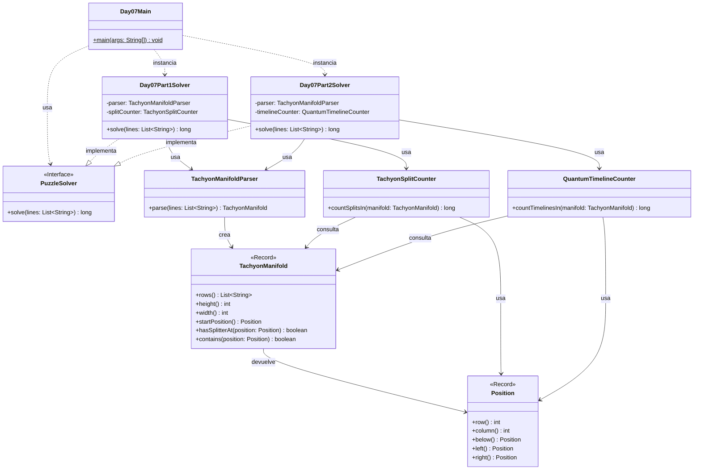

# Advent of Code 2025 - Day 7: Laboratories

Este proyecto contiene la solución para el **Día 7** del Advent of Code 2025: **Laboratories**.

El problema consiste en analizar un diagrama de un manifold de taquiones. Un haz o partícula de taquiones entra por la posición marcada con `S` y siempre avanza hacia abajo. En el mapa pueden aparecer divisores, representados con `^`, que modifican el comportamiento del haz.

El día está dividido en dos partes:

* **Parte 1**: contar cuántas veces se divide el haz clásico de taquiones.
* **Parte 2**: contar cuántas líneas temporales se generan en un manifold cuántico.

---

## Descripción del problema

La entrada es un diagrama formado por caracteres:

```text id="fcr8po"
. → espacio vacío
S → posición inicial del haz
^ → splitter o divisor
```

Ejemplo:

```text id="uxr9x7"
.......S.......
...............
.......^.......
...............
......^.^......
...............
.....^.^.^.....
...............
....^.^...^....
...............
...^.^...^.^...
...............
..^...^.....^..
...............
.^.^.^.^.^...^.
...............
```

El haz empieza en `S` y se mueve siempre hacia abajo.

Cuando encuentra un `^`, el haz se detiene en esa posición y salen dos nuevos haces:

```text id="rn90dt"
uno hacia la izquierda
uno hacia la derecha
```

A partir de ahí, esos nuevos haces continúan bajando.

---

## Parte 1

En la primera parte se analiza un manifold clásico.

Cuando varios haces llegan a la misma posición o columna, se consideran como un único haz activo. Por eso, para simular esta parte, basta con mantener el conjunto de columnas activas en cada fila.

La pregunta es:

```text id="zm02b9"
¿Cuántas veces se divide el haz?
```

Con el ejemplo oficial, el resultado es:

```text id="n9ptsp"
21
```

Con el input real del usuario, el resultado de la parte 1 es:

```text id="shq4ho"
1626
```

---

## Parte 2

En la segunda parte, el manifold es cuántico.

Ahora solo se envía una partícula, pero cada vez que llega a un splitter, el tiempo se divide en dos líneas temporales:

```text id="q5iwwy"
una línea temporal donde la partícula va a la izquierda
otra línea temporal donde la partícula va a la derecha
```

A diferencia de la parte 1, si varias líneas temporales llegan a la misma columna, **no se fusionan**. Hay que conservar la multiplicidad.

La pregunta es:

```text id="r56zq2"
¿Cuántas líneas temporales quedan activas al final?
```

Con el ejemplo oficial, el resultado es:

```text id="hi8bsm"
40
```

Con el input real del usuario, el resultado de la parte 2 es:

```text id="c54c6u"
48989920237096
```

---

## Diseño y arquitectura

La solución mantiene la estructura modular usada en los días anteriores:

```text id="ogfs7w"
day07
├── Day07Main.java
├── common
├── part1
└── part2
```

La parte común contiene el modelo del manifold, el parser y la posición.

La parte 1 y la parte 2 tienen clases específicas porque la simulación cambia bastante:

```text id="wbe6dd"
Parte 1 → se cuentan divisiones de haces clásicos
Parte 2 → se cuentan líneas temporales con multiplicidad
```

Por tanto, se evita modificar `TachyonSplitCounter` para adaptarlo a la parte 2. En su lugar, se crea una clase nueva:

```text id="oxitvy"
QuantumTimelineCounter
```

Esto sigue la regla del proyecto:

```text id="w1y85j"
Si una clase necesita una modificación grande para una nueva parte,
se crea una clase específica en part1 o part2.
```

---

## Principios aplicados

### Single Responsibility Principle, SRP

Cada clase tiene una única responsabilidad:

* `Day07Main`: ejecuta el día 7 y muestra los resultados.
* `Position`: representa una posición dentro del manifold.
* `TachyonManifold`: representa el diagrama del manifold.
* `TachyonManifoldParser`: convierte el input textual en un `TachyonManifold`.
* `TachyonSplitCounter`: cuenta las divisiones de haces en la parte 1.
* `QuantumTimelineCounter`: cuenta líneas temporales en la parte 2.
* `Day07Part1Solver`: resuelve únicamente la parte 1.
* `Day07Part2Solver`: resuelve únicamente la parte 2.

Esta separación permite entender, probar y modificar cada pieza de forma aislada.

---

### Open/Closed Principle, OCP

La parte 2 se añade sin modificar la lógica de la parte 1.

La parte 1 conserva su clase:

```text id="gtj9rv"
TachyonSplitCounter
```

La parte 2 introduce una nueva clase:

```text id="v9xhej"
QuantumTimelineCounter
```

Así, el código existente queda cerrado a modificaciones innecesarias, pero el sistema sigue abierto a extensión.

---

### Dependency Inversion Principle, DIP

Los solvers implementan la interfaz común:

```java id="ksp9xp"
PuzzleSolver
```

Esto permite que el `Main` pueda ejecutarlos de manera uniforme:

```java id="out7cf"
PuzzleSolver part1Solver = new Day07Part1Solver();
PuzzleSolver part2Solver = new Day07Part2Solver();
```

El punto de entrada no necesita conocer los detalles internos de la simulación.

---

### DRY

La lógica común del día 7 se mantiene en:

```text id="p91pws"
es.ulpgc.aoc2025.day07.common
```

Aquí se encuentran:

* `Position`
* `TachyonManifold`
* `TachyonManifoldParser`

Estas clases se reutilizan tanto en la parte 1 como en la parte 2.

La diferencia entre partes se mantiene separada en sus respectivos paquetes.

---

### Código expresivo

Los nombres de las clases representan directamente los conceptos del problema:

* `TachyonManifold`: el diagrama del manifold.
* `Position`: una posición concreta.
* `TachyonSplitCounter`: contador de divisiones del haz.
* `QuantumTimelineCounter`: contador de líneas temporales cuánticas.

Esto hace que el código sea más fácil de leer y relacionar con el enunciado.

---

## Estructura del proyecto

```text id="hl1efv"
src
├── main
│   ├── java
│   │   └── es
│   │       └── ulpgc
│   │           └── aoc2025
│   │               ├── common
│   │               │   └── PuzzleSolver.java
│   │               │
│   │               └── day07
│   │                   ├── Day07Main.java
│   │                   │
│   │                   ├── common
│   │                   │   ├── Position.java
│   │                   │   ├── TachyonManifold.java
│   │                   │   └── TachyonManifoldParser.java
│   │                   │
│   │                   ├── part1
│   │                   │   ├── Day07Part1Solver.java
│   │                   │   └── TachyonSplitCounter.java
│   │                   │
│   │                   └── part2
│   │                       ├── Day07Part2Solver.java
│   │                       └── QuantumTimelineCounter.java
│   │
│   └── resources
│       └── day07
│           └── input.txt
│
└── test
    └── java
        └── es
            └── ulpgc
                └── aoc2025
                    └── day07
                        ├── part1
                        │   └── Day07Part1SolverTest.java
                        └── part2
                            └── Day07Part2SolverTest.java
```

---

## Paquetes principales

### `es.ulpgc.aoc2025.common`

Contiene código común a todo el proyecto Advent of Code.

Actualmente contiene:

```text id="nbic0d"
PuzzleSolver.java
```

Esta interfaz define el contrato general de todos los solvers:

```java id="ri4bpz"
long solve(List<String> lines);
```

---

### `es.ulpgc.aoc2025.day07`

Contiene el punto de entrada específico del día 7:

```text id="wz3j23"
Day07Main.java
```

Esta clase se encarga de:

1. leer el archivo de entrada;
2. crear el solver de la parte 1;
3. crear el solver de la parte 2;
4. ejecutar ambos solvers;
5. mostrar los resultados por consola.

---

### `es.ulpgc.aoc2025.day07.common`

Contiene las clases comunes del dominio del día 7.

Estas clases no dependen de una parte concreta.

---

### `es.ulpgc.aoc2025.day07.part1`

Contiene la solución específica de la primera parte.

---

### `es.ulpgc.aoc2025.day07.part2`

Contiene la solución específica de la segunda parte.

---

## Clases principales

### `Position`

Representa una posición dentro del manifold.

```java id="m2dzni"
package es.ulpgc.aoc2025.day07.common;

public record Position(int row, int column) {

    public Position below() {
        return new Position(row + 1, column);
    }

    public Position left() {
        return new Position(row, column - 1);
    }

    public Position right() {
        return new Position(row, column + 1);
    }
}
```

Responsabilidades:

* almacenar fila y columna;
* representar posiciones vecinas;
* permitir que la simulación se exprese con claridad.

No valida posiciones negativas porque un haz puede salir del manifold. La comprobación de límites pertenece a `TachyonManifold`.

---

### `TachyonManifold`

Representa el diagrama del manifold.

```java id="zqzex2"
package es.ulpgc.aoc2025.day07.common;

import java.util.List;

public record TachyonManifold(List<String> rows) {

    private static final char START = 'S';
    private static final char SPLITTER = '^';

    public TachyonManifold {
        if (rows == null) {
            throw new IllegalArgumentException("Rows cannot be null");
        }

        if (rows.isEmpty()) {
            throw new IllegalArgumentException("Rows cannot be empty");
        }

        int width = rows.getFirst().length();

        for (String row : rows) {
            if (row == null) {
                throw new IllegalArgumentException("Row cannot be null");
            }

            if (row.length() != width) {
                throw new IllegalArgumentException("All rows must have the same width");
            }

            if (!row.matches("[.S^]+")) {
                throw new IllegalArgumentException("Rows can only contain '.', 'S' and '^'");
            }
        }

        if (countStartPositionsIn(rows) != 1) {
            throw new IllegalArgumentException("The manifold must contain exactly one start position");
        }

        rows = List.copyOf(rows);
    }

    public int height() {
        return rows.size();
    }

    public int width() {
        return rows.getFirst().length();
    }

    public Position startPosition() {
        for (int row = 0; row < height(); row++) {
            int column = rows.get(row).indexOf(START);

            if (column != -1) {
                return new Position(row, column);
            }
        }

        throw new IllegalStateException("Start position not found");
    }

    public boolean hasSplitterAt(Position position) {
        return contains(position)
                && rows.get(position.row()).charAt(position.column()) == SPLITTER;
    }

    public boolean contains(Position position) {
        return 0 <= position.row() && position.row() < height()
                && 0 <= position.column() && position.column() < width();
    }

    private static int countStartPositionsIn(List<String> rows) {
        int count = 0;

        for (String row : rows) {
            for (int column = 0; column < row.length(); column++) {
                if (row.charAt(column) == START) {
                    count++;
                }
            }
        }

        return count;
    }
}
```

Responsabilidades:

* almacenar las filas del manifold;
* validar el formato;
* localizar la posición inicial;
* comprobar si una posición contiene un splitter;
* comprobar si una posición está dentro del mapa.

---

### `TachyonManifoldParser`

Convierte las líneas del input en un `TachyonManifold`.

```java id="q955r0"
package es.ulpgc.aoc2025.day07.common;

import java.util.ArrayList;
import java.util.List;

public class TachyonManifoldParser {

    public TachyonManifold parse(List<String> lines) {
        List<String> rows = new ArrayList<>();

        for (String line : lines) {
            if (!line.isBlank()) {
                rows.add(line.trim());
            }
        }

        return new TachyonManifold(rows);
    }
}
```

En este día sí se puede usar `trim()` porque el mapa está formado por caracteres visibles `.` `S` y `^`. A diferencia del día 6, los espacios no forman parte del formato del problema.

---

### `TachyonSplitCounter`

Cuenta las divisiones del haz en la parte 1.

```java id="eoijno"
package es.ulpgc.aoc2025.day07.part1;

import es.ulpgc.aoc2025.day07.common.Position;
import es.ulpgc.aoc2025.day07.common.TachyonManifold;

import java.util.HashSet;
import java.util.Set;

public class TachyonSplitCounter {

    public long countSplitsIn(TachyonManifold manifold) {
        Position start = manifold.startPosition();

        Set<Integer> activeColumns = new HashSet<>();
        activeColumns.add(start.column());

        long splits = 0;

        for (int row = start.row() + 1; row < manifold.height(); row++) {
            Set<Integer> nextActiveColumns = new HashSet<>();

            for (int column : activeColumns) {
                Position position = new Position(row, column);

                if (!manifold.contains(position)) {
                    continue;
                }

                if (manifold.hasSplitterAt(position)) {
                    splits++;
                    nextActiveColumns.add(column - 1);
                    nextActiveColumns.add(column + 1);
                } else {
                    nextActiveColumns.add(column);
                }
            }

            activeColumns = nextActiveColumns;
        }

        return splits;
    }
}
```

La clave de esta clase es usar:

```java id="oclt9h"
Set<Integer>
```

porque en la parte 1 solo importa si una columna está activa o no.

---

### `QuantumTimelineCounter`

Cuenta las líneas temporales en la parte 2.

```java id="hjrxsq"
package es.ulpgc.aoc2025.day07.part2;

import es.ulpgc.aoc2025.day07.common.Position;
import es.ulpgc.aoc2025.day07.common.TachyonManifold;

import java.util.HashMap;
import java.util.Map;

public class QuantumTimelineCounter {

    public long countTimelinesIn(TachyonManifold manifold) {
        Position start = manifold.startPosition();

        Map<Integer, Long> activeTimelinesByColumn = new HashMap<>();
        activeTimelinesByColumn.put(start.column(), 1L);

        for (int row = start.row() + 1; row < manifold.height(); row++) {
            Map<Integer, Long> nextTimelinesByColumn = new HashMap<>();

            for (Map.Entry<Integer, Long> entry : activeTimelinesByColumn.entrySet()) {
                int column = entry.getKey();
                long timelines = entry.getValue();

                Position position = new Position(row, column);

                if (!manifold.contains(position)) {
                    continue;
                }

                if (manifold.hasSplitterAt(position)) {
                    addTimelinesTo(nextTimelinesByColumn, column - 1, timelines, manifold);
                    addTimelinesTo(nextTimelinesByColumn, column + 1, timelines, manifold);
                } else {
                    addTimelinesTo(nextTimelinesByColumn, column, timelines, manifold);
                }
            }

            activeTimelinesByColumn = nextTimelinesByColumn;
        }

        return totalTimelinesIn(activeTimelinesByColumn);
    }

    private void addTimelinesTo(
            Map<Integer, Long> timelinesByColumn,
            int column,
            long timelines,
            TachyonManifold manifold
    ) {
        if (column < 0 || column >= manifold.width()) {
            return;
        }

        timelinesByColumn.merge(column, timelines, Long::sum);
    }

    private long totalTimelinesIn(Map<Integer, Long> timelinesByColumn) {
        long total = 0;

        for (long timelines : timelinesByColumn.values()) {
            total += timelines;
        }

        return total;
    }
}
```

La clave de esta clase es usar:

```java id="nj4fcv"
Map<Integer, Long>
```

porque en la parte 2 importa cuántas líneas temporales llegan a cada columna.

---

### `Day07Part1Solver`

Resuelve la primera parte del problema.

Su algoritmo es:

1. parsear el manifold;
2. localizar la posición inicial;
3. simular el avance de los haces;
4. contar cuántas veces se produce una división.

---

### `Day07Part2Solver`

Resuelve la segunda parte del problema.

Su algoritmo es:

1. parsear el manifold;
2. localizar la posición inicial;
3. simular el avance de las líneas temporales;
4. sumar cuántas líneas temporales quedan al final.

---

## Estrategia de resolución

### Parte 1: haces clásicos

En la parte 1 varios haces pueden terminar ocupando la misma columna. En ese caso, se consideran como un único haz activo.

Por eso se usa:

```java id="nmk0my"
Set<Integer> activeColumns
```

Cuando un haz encuentra un splitter:

```text id="f5gd13"
^
```

se incrementa el contador de divisiones y se activan las columnas:

```text id="o0xhtw"
column - 1
column + 1
```

---

### Parte 2: líneas temporales cuánticas

En la parte 2, cada splitter duplica líneas temporales.

Si varias líneas temporales llegan a la misma columna, no se fusionan: se acumulan.

Por eso se usa:

```java id="rpwqpp"
Map<Integer, Long> activeTimelinesByColumn
```

La clave del mapa es la columna, y el valor es el número de líneas temporales que llegan a esa columna.

Cuando una posición contiene un splitter, las líneas temporales de esa columna se reparten en dos nuevas columnas:

```text id="vh6ze7"
column - 1
column + 1
```

Cada una recibe el mismo número de líneas temporales que había en la columna original.

---

## Diagrama de arquitectura



---

## Entrada del programa

El archivo de entrada debe colocarse en:

```text id="y0pq6j"
src/main/resources/day07/input.txt
```

El contenido debe estar formado por un mapa con los caracteres:

```text id="kjc6ll"
.
S
^
```

Ejemplo:

```text id="wyaejy"
.......S.......
...............
.......^.......
...............
......^.^......
...............
.....^.^.^.....
...............
....^.^...^....
...............
...^.^...^.^...
...............
..^...^.....^..
...............
.^.^.^.^.^...^.
...............
```

---

## Ejecución en IntelliJ IDEA

Para ejecutar el día 7:

1. abrir el archivo:

```text id="g457rk"
src/main/java/es/ulpgc/aoc2025/day07/Day07Main.java
```

2. pulsar el botón verde junto al método `main`;

3. seleccionar:

```text id="v7zb5o"
Run 'Day07Main.main()'
```

La salida tendrá este formato:

```text id="bzqq09"
Day 07 - Part 1: 1626
Day 07 - Part 2: 48989920237096
```

---

## Ejecución con Maven

Para ejecutar los tests:

```bash id="d9yr1d"
mvn test
```

---

## Tests

El proyecto incluye tests separados para cada parte:

```text id="nn0l8u"
Day07Part1SolverTest.java
Day07Part2SolverTest.java
```

Los tests usan el ejemplo oficial:

```text id="maj1ko"
.......S.......
...............
.......^.......
...............
......^.^......
...............
.....^.^.^.....
...............
....^.^...^....
...............
...^.^...^.^...
...............
..^...^.....^..
...............
.^.^.^.^.^...^.
...............
```

Resultado esperado para la parte 1:

```text id="h4fgt4"
21
```

Resultado esperado para la parte 2:

```text id="hdrh8z"
40
```

---

## Convención para próximos días

Cada día del Advent of Code seguirá la misma estructura:

```text id="xwrebr"
dayXX
├── DayXXMain.java
├── common
├── part1
└── part2
```

Ejemplo para el día 8:

```text id="hsrvfw"
day08
├── Day08Main.java
├── common
├── part1
└── part2
```

Cuando una clase pueda compartirse sin modificar su comportamiento, se coloca en `common`.

Cuando una parte requiera modificar mucho el comportamiento de una clase común, se crea una clase específica dentro de `part1` o `part2`.

Cuando el cambio sea pequeño y coherente con la responsabilidad de la clase, se añade directamente a la clase común y se marca con un comentario.

En este día:

```text id="h07uck"
TachyonManifold       → common
TachyonManifoldParser → common
Position              → common
TachyonSplitCounter   → específico de part1
QuantumTimelineCounter → específico de part2
```

---

## Conclusión

La solución del día 7 está organizada para separar claramente el modelo común del manifold y las dos formas de interpretar el comportamiento de los taquiones.

La parte 1 cuenta divisiones de haces clásicos usando un conjunto de columnas activas.

La parte 2 cuenta líneas temporales cuánticas usando un mapa de columnas a multiplicidades.

La decisión de diseño más importante es no modificar `TachyonSplitCounter` para resolver la parte 2, ya que el significado de la simulación cambia bastante. En su lugar, se crea `QuantumTimelineCounter`, manteniendo bajo acoplamiento, alta cohesión y una estructura preparada para seguir creciendo.
