# Advent of Code 2025 - Day 8: Playground

Este proyecto contiene la solución para el **Día 8** del Advent of Code 2025: **Playground**.

El problema consiste en analizar una colección de cajas de conexión eléctrica suspendidas en un espacio tridimensional. Cada caja está representada por una posición en coordenadas `X,Y,Z`.

El objetivo es decidir qué cajas conectar entre sí usando las conexiones más cortas posibles.

El día está dividido en dos partes:

* **Parte 1**: conectar los 1000 pares de cajas más cercanos y multiplicar los tamaños de los tres circuitos más grandes.
* **Parte 2**: seguir conectando cajas hasta que todas formen un único circuito y multiplicar las coordenadas `X` de las dos cajas de la última conexión necesaria.

---

## Descripción del problema

La entrada contiene una lista de posiciones en 3D, una por línea.

Ejemplo:

```text
162,817,812
57,618,57
906,360,560
592,479,940
352,342,300
466,668,158
542,29,236
431,825,988
739,650,466
52,470,668
216,146,977
819,987,18
117,168,530
805,96,715
346,949,466
970,615,88
941,993,340
862,61,35
984,92,344
425,690,689
```

Cada línea representa una caja de conexión:

```text
X,Y,Z
```

Por ejemplo:

```text
162,817,812
```

representa una caja situada en:

```text
X = 162
Y = 817
Z = 812
```

---

## Parte 1

En la primera parte se deben conectar los pares de cajas más cercanos.

La distancia entre dos cajas se calcula mediante distancia euclídea en 3D:

```text
sqrt((x1 - x2)^2 + (y1 - y2)^2 + (z1 - z2)^2)
```

Sin embargo, para comparar distancias no es necesario calcular la raíz cuadrada. Basta con comparar la distancia al cuadrado:

```text
(x1 - x2)^2 + (y1 - y2)^2 + (z1 - z2)^2
```

El proceso es:

1. generar todos los pares posibles de cajas;
2. calcular la distancia al cuadrado de cada par;
3. ordenar las conexiones de menor a mayor distancia;
4. aplicar las 1000 conexiones más cortas;
5. calcular el tamaño de cada circuito;
6. multiplicar los tamaños de los tres circuitos más grandes.

Con el ejemplo oficial, tras hacer las 10 conexiones más cortas, los tres circuitos más grandes tienen tamaños:

```text
5, 4, 2
```

Por tanto:

```text
5 * 4 * 2 = 40
```

Resultado del ejemplo:

```text
40
```

---

## Parte 2

En la segunda parte ya no se hacen exactamente 1000 conexiones.

Ahora se deben seguir aplicando conexiones, de menor a mayor distancia, hasta que todas las cajas formen un único circuito.

La pregunta es:

```text
¿Cuál es la última conexión necesaria para que todo quede conectado?
```

Cuando se encuentra esa conexión, se toman las coordenadas `X` de las dos cajas conectadas y se multiplican.

En el ejemplo oficial, la conexión que termina de unir todo el circuito es entre:

```text
216,146,977
117,168,530
```

Sus coordenadas `X` son:

```text
216
117
```

Por tanto:

```text
216 * 117 = 25272
```

Resultado del ejemplo:

```text
25272
```

---

## Diseño y arquitectura

La solución mantiene la estructura modular usada en los días anteriores:

```text
day08
├── Day08Main.java
├── common
├── part1
└── part2
```

En este día aparece una estructura de datos importante:

```text
Union-Find
```

también conocida como:

```text
Disjoint Set
```

Esta estructura permite representar circuitos de cajas conectadas.

Al principio, cada caja está en su propio circuito. Cuando se conecta un par de cajas, sus circuitos se fusionan.

---

## Decisión de diseño tras añadir la parte 2

Inicialmente, en la parte 1, clases como `CircuitDisjointSet` y `JunctionBoxConnection` podían estar en `part1`.

Sin embargo, al aparecer la parte 2, se observa que esas clases son útiles para ambas partes.

Por eso se mueven a `common`:

```text
CircuitDisjointSet
JunctionBoxConnection
JunctionBoxConnectionGenerator
```

La parte 1 y la parte 2 conservan analizadores separados:

```text
ShortestConnectionCircuitAnalyzer → específico de part1
FinalCircuitConnectionAnalyzer    → específico de part2
```

Esto sigue la regla de diseño del proyecto:

```text
Si una clase se modifica mucho para una parte nueva,
se crea una clase específica para esa parte.

Si el cambio es pequeño y reutilizable,
se mueve o amplía la clase común.
```

---

## Principios aplicados

### Single Responsibility Principle, SRP

Cada clase tiene una única responsabilidad:

* `Day08Main`: ejecuta el día 8 y muestra los resultados.
* `JunctionBoxPosition`: representa una posición 3D.
* `JunctionBoxMap`: representa el conjunto de cajas.
* `JunctionBoxMapParser`: convierte el input textual en un mapa de cajas.
* `JunctionBoxConnection`: representa una posible conexión entre dos cajas.
* `JunctionBoxConnectionGenerator`: genera y ordena todas las conexiones posibles.
* `CircuitDisjointSet`: gestiona los circuitos conectados.
* `ShortestConnectionCircuitAnalyzer`: resuelve la lógica específica de la parte 1.
* `FinalCircuitConnectionAnalyzer`: resuelve la lógica específica de la parte 2.
* `Day08Part1Solver`: resuelve únicamente la parte 1.
* `Day08Part2Solver`: resuelve únicamente la parte 2.

---

### Open/Closed Principle, OCP

La parte 2 se añade sin modificar la lógica específica de la parte 1.

La clase de la parte 1 sigue siendo:

```text
ShortestConnectionCircuitAnalyzer
```

La parte 2 añade una clase nueva:

```text
FinalCircuitConnectionAnalyzer
```

Así, el código de la parte 1 queda cerrado a modificaciones innecesarias, pero el diseño sigue abierto a extensión.

---

### Dependency Inversion Principle, DIP

Los solvers implementan la interfaz común:

```java
PuzzleSolver
```

Esto permite tratarlos de manera uniforme desde el `Main`:

```java
PuzzleSolver part1Solver = new Day08Part1Solver();
PuzzleSolver part2Solver = new Day08Part2Solver();
```

El punto de entrada no necesita conocer los detalles internos de cada algoritmo.

---

### DRY

La generación de conexiones y la estructura Union-Find son necesarias tanto en la parte 1 como en la parte 2.

Por eso se colocan en `common`:

```text
CircuitDisjointSet
JunctionBoxConnection
JunctionBoxConnectionGenerator
```

Así se evita duplicar código entre partes.

---

### Código expresivo

Los nombres de las clases reflejan directamente el dominio del problema:

* `JunctionBoxPosition`: posición de una caja de conexión.
* `JunctionBoxMap`: mapa de cajas.
* `JunctionBoxConnection`: conexión entre dos cajas.
* `CircuitDisjointSet`: estructura de circuitos conectados.
* `ShortestConnectionCircuitAnalyzer`: analiza las conexiones más cortas.
* `FinalCircuitConnectionAnalyzer`: analiza la última conexión necesaria para unir todo.

---

## Estructura del proyecto

```text
src
├── main
│   ├── java
│   │   └── es
│   │       └── ulpgc
│   │           └── aoc2025
│   │               ├── common
│   │               │   └── PuzzleSolver.java
│   │               │
│   │               └── day08
│   │                   ├── Day08Main.java
│   │                   │
│   │                   ├── common
│   │                   │   ├── CircuitDisjointSet.java
│   │                   │   ├── JunctionBoxConnection.java
│   │                   │   ├── JunctionBoxConnectionGenerator.java
│   │                   │   ├── JunctionBoxMap.java
│   │                   │   ├── JunctionBoxMapParser.java
│   │                   │   └── JunctionBoxPosition.java
│   │                   │
│   │                   ├── part1
│   │                   │   ├── Day08Part1Solver.java
│   │                   │   └── ShortestConnectionCircuitAnalyzer.java
│   │                   │
│   │                   └── part2
│   │                       ├── Day08Part2Solver.java
│   │                       └── FinalCircuitConnectionAnalyzer.java
│   │
│   └── resources
│       └── day08
│           └── input.txt
│
└── test
    └── java
        └── es
            └── ulpgc
                └── aoc2025
                    └── day08
                        ├── part1
                        │   └── Day08Part1SolverTest.java
                        └── part2
                            └── Day08Part2SolverTest.java
```

---

## Paquetes principales

### `es.ulpgc.aoc2025.common`

Contiene código común a todo el proyecto Advent of Code.

Actualmente contiene:

```text
PuzzleSolver.java
```

Esta interfaz define el contrato común de todos los solvers:

```java
long solve(List<String> lines);
```

---

### `es.ulpgc.aoc2025.day08`

Contiene el punto de entrada específico del día 8:

```text
Day08Main.java
```

Esta clase se encarga de:

1. leer el archivo de entrada;
2. crear el solver de la parte 1;
3. crear el solver de la parte 2;
4. ejecutar ambos solvers;
5. mostrar los resultados por consola.

---

### `es.ulpgc.aoc2025.day08.common`

Contiene las clases comunes del dominio del día 8.

Estas clases se reutilizan en ambas partes.

---

### `es.ulpgc.aoc2025.day08.part1`

Contiene la solución específica de la primera parte.

---

### `es.ulpgc.aoc2025.day08.part2`

Contiene la solución específica de la segunda parte.

---

## Clases principales

### `JunctionBoxPosition`

Representa una posición tridimensional.

```java
package es.ulpgc.aoc2025.day08.common;

public record JunctionBoxPosition(int x, int y, int z) {

    public long squaredDistanceTo(JunctionBoxPosition other) {
        long dx = (long) x - other.x;
        long dy = (long) y - other.y;
        long dz = (long) z - other.z;

        return dx * dx + dy * dy + dz * dz;
    }
}
```

Responsabilidades:

* almacenar coordenadas `x`, `y`, `z`;
* calcular la distancia al cuadrado con otra posición.

---

### `JunctionBoxMap`

Representa el conjunto de cajas de conexión.

```java
package es.ulpgc.aoc2025.day08.common;

import java.util.List;

public record JunctionBoxMap(List<JunctionBoxPosition> positions) {

    public JunctionBoxMap {
        if (positions == null) {
            throw new IllegalArgumentException("Positions cannot be null");
        }

        if (positions.isEmpty()) {
            throw new IllegalArgumentException("There must be at least one junction box");
        }

        positions = List.copyOf(positions);
    }

    public int size() {
        return positions.size();
    }

    public JunctionBoxPosition positionAt(int index) {
        return positions.get(index);
    }
}
```

Responsabilidades:

* almacenar las posiciones;
* validar que exista al menos una caja;
* permitir consultar una posición por índice.

---

### `JunctionBoxMapParser`

Convierte las líneas del input en un `JunctionBoxMap`.

```java
package es.ulpgc.aoc2025.day08.common;

import java.util.ArrayList;
import java.util.List;

public class JunctionBoxMapParser {

    public JunctionBoxMap parse(List<String> lines) {
        List<JunctionBoxPosition> positions = new ArrayList<>();

        for (String line : lines) {
            if (line.isBlank()) {
                continue;
            }

            positions.add(parsePosition(line.trim()));
        }

        return new JunctionBoxMap(positions);
    }

    private JunctionBoxPosition parsePosition(String line) {
        String[] coordinates = line.split(",");

        if (coordinates.length != 3) {
            throw new IllegalArgumentException("Invalid position: " + line);
        }

        int x = Integer.parseInt(coordinates[0]);
        int y = Integer.parseInt(coordinates[1]);
        int z = Integer.parseInt(coordinates[2]);

        return new JunctionBoxPosition(x, y, z);
    }
}
```

Responsabilidades:

* ignorar líneas vacías;
* separar cada línea por comas;
* convertir los valores a enteros;
* crear posiciones 3D.

---

### `JunctionBoxConnection`

Representa una conexión posible entre dos cajas.

```java
package es.ulpgc.aoc2025.day08.common;

public record JunctionBoxConnection(
        int firstIndex,
        int secondIndex,
        long squaredDistance
) implements Comparable<JunctionBoxConnection> {

    @Override
    public int compareTo(JunctionBoxConnection other) {
        int distanceComparison = Long.compare(this.squaredDistance, other.squaredDistance);

        if (distanceComparison != 0) {
            return distanceComparison;
        }

        int firstIndexComparison = Integer.compare(this.firstIndex, other.firstIndex);

        if (firstIndexComparison != 0) {
            return firstIndexComparison;
        }

        return Integer.compare(this.secondIndex, other.secondIndex);
    }
}
```

Responsabilidades:

* almacenar los índices de las dos cajas conectadas;
* almacenar la distancia al cuadrado;
* permitir ordenar conexiones de menor a mayor distancia.

---

### `JunctionBoxConnectionGenerator`

Genera todas las conexiones posibles entre cajas y las ordena.

```java
package es.ulpgc.aoc2025.day08.common;

import java.util.ArrayList;
import java.util.Comparator;
import java.util.List;

public class JunctionBoxConnectionGenerator {

    public List<JunctionBoxConnection> sortedConnectionsOf(JunctionBoxMap map) {
        List<JunctionBoxConnection> connections = new ArrayList<>();

        for (int first = 0; first < map.size() - 1; first++) {
            for (int second = first + 1; second < map.size(); second++) {
                long squaredDistance = map.positionAt(first)
                        .squaredDistanceTo(map.positionAt(second));

                connections.add(new JunctionBoxConnection(first, second, squaredDistance));
            }
        }

        connections.sort(Comparator.naturalOrder());

        return connections;
    }
}
```

Responsabilidades:

* generar todos los pares posibles;
* calcular la distancia de cada par;
* devolver las conexiones ordenadas de menor a mayor distancia.

---

### `CircuitDisjointSet`

Representa los circuitos conectados usando Union-Find.

```java
package es.ulpgc.aoc2025.day08.common;

import java.util.ArrayList;
import java.util.List;

public class CircuitDisjointSet {

    private final int[] parent;
    private final int[] size;

    // Añadido para parte 2.
    // Permite saber cuándo todas las cajas forman un único circuito.
    private int componentCount;

    public CircuitDisjointSet(int elements) {
        if (elements <= 0) {
            throw new IllegalArgumentException("Elements must be positive");
        }

        this.parent = new int[elements];
        this.size = new int[elements];
        this.componentCount = elements;

        for (int i = 0; i < elements; i++) {
            parent[i] = i;
            size[i] = 1;
        }
    }

    public boolean union(int first, int second) {
        int firstRoot = find(first);
        int secondRoot = find(second);

        if (firstRoot == secondRoot) {
            return false;
        }

        if (size[firstRoot] < size[secondRoot]) {
            parent[firstRoot] = secondRoot;
            size[secondRoot] += size[firstRoot];
        } else {
            parent[secondRoot] = firstRoot;
            size[firstRoot] += size[secondRoot];
        }

        componentCount--;
        return true;
    }

    public boolean isSingleComponent() {
        return componentCount == 1;
    }

    public List<Integer> componentSizes() {
        List<Integer> sizes = new ArrayList<>();

        for (int i = 0; i < parent.length; i++) {
            if (find(i) == i) {
                sizes.add(size[i]);
            }
        }

        return sizes;
    }

    private int find(int element) {
        if (parent[element] != element) {
            parent[element] = find(parent[element]);
        }

        return parent[element];
    }
}
```

Responsabilidades:

* representar componentes conectadas;
* unir dos circuitos;
* saber si ya existe un único circuito;
* obtener los tamaños de los circuitos.

---

### `ShortestConnectionCircuitAnalyzer`

Resuelve la lógica de la parte 1.

Su algoritmo es:

1. generar todas las conexiones posibles;
2. ordenarlas por distancia;
3. aplicar las primeras 1000 conexiones;
4. obtener los tamaños de los circuitos;
5. multiplicar los tres tamaños más grandes.

---

### `FinalCircuitConnectionAnalyzer`

Resuelve la lógica de la parte 2.

Su algoritmo es:

1. generar todas las conexiones posibles;
2. ordenarlas por distancia;
3. recorrerlas de menor a mayor;
4. unir circuitos distintos;
5. detenerse cuando todo forme un único circuito;
6. tomar las coordenadas `X` de las dos cajas de esa última conexión;
7. multiplicarlas.

---

## Estrategia de resolución

### Generación de conexiones

Si hay `N` cajas, el número de conexiones posibles es:

```text
N * (N - 1) / 2
```

Para cada par se calcula la distancia al cuadrado.

Esto evita el uso de `Math.sqrt`, ya que la raíz cuadrada no cambia el orden de las distancias.

---

### Union-Find

Union-Find permite resolver eficientemente preguntas como:

```text
¿Estas dos cajas ya están en el mismo circuito?
```

y operaciones como:

```text
Unir el circuito de la caja A con el circuito de la caja B
```

La estructura usa:

* `parent`: representante de cada conjunto;
* `size`: tamaño de cada conjunto;
* compresión de caminos en `find`;
* unión por tamaño en `union`.

---

### Parte 1

En la parte 1 se aplican exactamente 1000 conexiones, aunque algunas conecten cajas que ya pertenecen al mismo circuito.

Esto es importante porque el enunciado habla de:

```text
connect together the 1000 pairs of junction boxes which are closest together
```

Es decir, se revisan los 1000 pares más cercanos, no las 1000 uniones efectivas.

---

### Parte 2

En la parte 2 se recorren las conexiones ordenadas hasta que `CircuitDisjointSet` indica que todas las cajas pertenecen a un único componente.

La última conexión que hace esto es la respuesta.

No se tienen en cuenta conexiones que no unan dos circuitos distintos, porque si dos cajas ya estaban conectadas indirectamente, esa conexión no cambia el estado del sistema.

---

## Diagrama de arquitectura

```mermaid
classDiagram
    class Day08Main {
        +main(args: String[]) void$
    }

    class PuzzleSolver {
        <<Interface>>
        +solve(lines: List~String~) long
    }

    class JunctionBoxPosition {
        <<Record>>
        +x() int
        +y() int
        +z() int
        +squaredDistanceTo(other: JunctionBoxPosition) long
    }

    class JunctionBoxMap {
        <<Record>>
        +positions() List~JunctionBoxPosition~
        +size() int
        +positionAt(index: int) JunctionBoxPosition
    }

    class JunctionBoxMapParser {
        +parse(lines: List~String~) JunctionBoxMap
    }

    class JunctionBoxConnection {
        <<Record>>
        +firstIndex() int
        +secondIndex() int
        +squaredDistance() long
        +compareTo(other: JunctionBoxConnection) int
    }

    class JunctionBoxConnectionGenerator {
        +sortedConnectionsOf(map: JunctionBoxMap) List~JunctionBoxConnection~
    }

    class CircuitDisjointSet {
        -parent: int[]
        -size: int[]
        -componentCount: int
        +union(first: int, second: int) boolean
        +isSingleComponent() boolean
        +componentSizes() List~Integer~
        -find(element: int) int
    }

    class ShortestConnectionCircuitAnalyzer {
        +productOfThreeLargestCircuitSizesAfter(map: JunctionBoxMap, connectionsToMake: int) long
    }

    class FinalCircuitConnectionAnalyzer {
        +productOfXCoordinatesOfFinalConnection(map: JunctionBoxMap) long
    }

    class Day08Part1Solver {
        -parser: JunctionBoxMapParser
        -analyzer: ShortestConnectionCircuitAnalyzer
        +solve(lines: List~String~) long
    }

    class Day08Part2Solver {
        -parser: JunctionBoxMapParser
        -analyzer: FinalCircuitConnectionAnalyzer
        +solve(lines: List~String~) long
    }

    Day08Main ..> PuzzleSolver : usa
    Day08Main ..> Day08Part1Solver : instancia
    Day08Main ..> Day08Part2Solver : instancia

    Day08Part1Solver ..|> PuzzleSolver : implementa
    Day08Part2Solver ..|> PuzzleSolver : implementa

    JunctionBoxMapParser --> JunctionBoxMap : crea
    JunctionBoxMapParser --> JunctionBoxPosition : crea

    JunctionBoxConnectionGenerator --> JunctionBoxMap : lee
    JunctionBoxConnectionGenerator --> JunctionBoxConnection : crea

    ShortestConnectionCircuitAnalyzer --> JunctionBoxConnectionGenerator : usa
    ShortestConnectionCircuitAnalyzer --> CircuitDisjointSet : usa

    FinalCircuitConnectionAnalyzer --> JunctionBoxConnectionGenerator : usa
    FinalCircuitConnectionAnalyzer --> CircuitDisjointSet : usa
    FinalCircuitConnectionAnalyzer --> JunctionBoxPosition : consulta
```



---

## Entrada del programa

El archivo de entrada debe colocarse en:

```text
src/main/resources/day08/input.txt
```

El formato debe ser:

```text
X,Y,Z
X,Y,Z
X,Y,Z
...
```

Ejemplo:

```text
162,817,812
57,618,57
906,360,560
592,479,940
```

---

## Ejecución en IntelliJ IDEA

Para ejecutar el día 8:

1. abrir el archivo:

```text
src/main/java/es/ulpgc/aoc2025/day08/Day08Main.java
```

2. pulsar el botón verde junto al método `main`;

3. seleccionar:

```text
Run 'Day08Main.main()'
```

La salida tendrá este formato:

```text
Day 08 - Part 1: <resultado_parte_1>
Day 08 - Part 2: <resultado_parte_2>
```

---

## Ejecución con Maven

Para ejecutar los tests:

```bash
mvn test
```

---

## Tests

El proyecto incluye tests separados para cada parte:

```text
Day08Part1SolverTest.java
Day08Part2SolverTest.java
```

Ambos tests usan el ejemplo oficial de 20 cajas.

Resultado esperado para la parte 1:

```text
40
```

Resultado esperado para la parte 2:

```text
25272
```

---

## Rendimiento

Si hay aproximadamente 1000 cajas, el número de pares posibles es:

```text
1000 * 999 / 2 = 499500
```

Ese volumen es manejable en Java.

Por tanto, para este problema no hace falta usar estructuras espaciales más complejas como k-d trees.

La solución genera todos los pares, los ordena y aplica Union-Find para unir componentes.

---

## Convención para próximos días

Cada día del Advent of Code seguirá la misma estructura:

```text
dayXX
├── DayXXMain.java
├── common
├── part1
└── part2
```

Ejemplo para el día 9:

```text
day09
├── Day09Main.java
├── common
├── part1
└── part2
```

Cuando una clase pueda compartirse sin modificar su comportamiento, se coloca en `common`.

Cuando una parte requiera modificar mucho el comportamiento de una clase existente, se crea una clase específica dentro de `part1` o `part2`.

Cuando el cambio sea pequeño y coherente con la responsabilidad de la clase, se añade directamente a la clase común y se marca con un comentario.

En este día:

```text
CircuitDisjointSet             → common
JunctionBoxConnection          → common
JunctionBoxConnectionGenerator → common
ShortestConnectionCircuitAnalyzer → específico de part1
FinalCircuitConnectionAnalyzer    → específico de part2
```

---

## Conclusión

La solución del día 8 está organizada alrededor de dos ideas principales:

```text
distancias entre puntos 3D
Union-Find para gestionar circuitos conectados
```

La parte 1 usa las 1000 conexiones más cortas para calcular el tamaño de los tres mayores circuitos.

La parte 2 continúa conectando pares hasta que todas las cajas quedan en un único circuito y devuelve el producto de las coordenadas `X` de la última conexión necesaria.

La reorganización de clases tras la parte 2 permite reutilizar correctamente el modelo común y mantener separada la lógica específica de cada parte.
