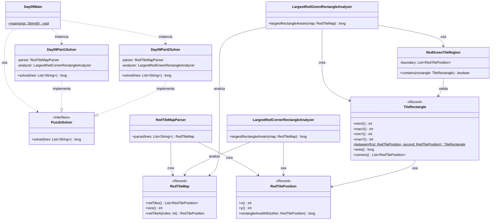

# Advent of Code 2025 - Day 9: Movie Theater

Este proyecto contiene la solución para el **Día 9** del Advent of Code 2025: **Movie Theater**.

El problema consiste en analizar una lista de baldosas rojas situadas en una cuadrícula. Cada baldosa roja aparece representada mediante una coordenada `X,Y`.

El día está dividido en dos partes:

* **Parte 1**: encontrar el mayor rectángulo posible usando dos baldosas rojas como esquinas opuestas.
* **Parte 2**: encontrar el mayor rectángulo posible usando dos baldosas rojas como esquinas opuestas, pero permitiendo únicamente baldosas rojas o verdes dentro del rectángulo.

---

## Descripción del problema

La entrada contiene una lista de posiciones de baldosas rojas.

Ejemplo:

```text
7,1
11,1
11,7
9,7
9,5
2,5
2,3
7,3
```

Cada línea representa una baldosa roja:

```text
X,Y
```

Por ejemplo:

```text
7,1
```

representa una baldosa roja situada en:

```text
X = 7
Y = 1
```

---

## Parte 1

En la primera parte se puede elegir cualquier par de baldosas rojas como esquinas opuestas de un rectángulo.

El área del rectángulo se calcula de forma inclusiva:

```text
width  = abs(x1 - x2) + 1
height = abs(y1 - y2) + 1
area   = width * height
```

Por ejemplo, entre las baldosas `2,5` y `9,7`:

```text
width  = abs(2 - 9) + 1 = 8
height = abs(5 - 7) + 1 = 3
area   = 8 * 3 = 24
```

Con el ejemplo oficial, el mayor rectángulo tiene área:

```text
50
```

Con el input real del usuario, el resultado de la parte 1 es:

```text
4759930955
```

---

## Parte 2

En la segunda parte aparece una restricción nueva.

Las baldosas rojas están conectadas entre sí siguiendo el orden de la lista. Cada baldosa roja está conectada con la anterior y con la siguiente mediante una línea recta de baldosas verdes. La lista se cierra, por lo que la última baldosa también está conectada con la primera.

Además, todas las baldosas que quedan dentro del bucle formado por rojas y verdes también se consideran verdes.

Ahora el rectángulo elegido debe cumplir dos condiciones:

1. sus esquinas opuestas deben ser baldosas rojas;
2. todas las baldosas dentro del rectángulo deben ser rojas o verdes.

Esto limita los rectángulos posibles, porque un rectángulo que en la parte 1 era válido puede atravesar zonas que no pertenecen a la región roja/verde.

Con el ejemplo oficial, el mayor rectángulo válido tiene área:

```text
24
```

Con el input real del usuario, el resultado de la parte 2 se obtiene ejecutando:

```text
Day09Main
```

Salida esperada:

```text
Day 09 - Part 1: 4759930955
Day 09 - Part 2: <resultado_parte_2>
```

---

## Diseño y arquitectura

La solución mantiene la estructura modular usada en los días anteriores:

```text
day09
├── Day09Main.java
├── common
├── part1
└── part2
```

En este día hay una diferencia importante entre ambas partes.

La parte 1 solo necesita analizar pares de puntos rojos.

La parte 2 necesita analizar una región cerrada formada por:

```text
baldosas rojas
baldosas verdes del borde
baldosas verdes interiores
```

Por eso no se modifica la clase de la parte 1. En su lugar, se crean clases específicas para la parte 2.

---

## Decisión de diseño tras añadir la parte 2

La parte 1 usa:

```text
LargestRedCornerRectangleAnalyzer
```

Esta clase se encarga únicamente de encontrar el mayor rectángulo usando dos esquinas rojas, sin restricciones sobre el contenido interno.

La parte 2 usa:

```text
LargestRedGreenRectangleAnalyzer
RedGreenTileRegion
TileRectangle
```

Esto sigue la regla de diseño del proyecto:

```text
Si una clase se modifica mucho para una parte nueva,
se crea una clase específica para esa parte.

Si el cambio es pequeño y coherente con la responsabilidad de la clase,
se añade directamente a la clase común y se marca con un comentario.
```

En este caso, la modificación es grande, porque cambia la definición de rectángulo válido. Por tanto, se crea una solución específica en `part2`.

---

## Principios aplicados

### Single Responsibility Principle, SRP

Cada clase tiene una responsabilidad clara:

* `Day09Main`: ejecuta el día 9 y muestra los resultados.
* `RedTilePosition`: representa una posición roja en la cuadrícula.
* `RedTileMap`: representa el conjunto de baldosas rojas.
* `RedTileMapParser`: convierte el input textual en un mapa de baldosas rojas.
* `LargestRedCornerRectangleAnalyzer`: resuelve la lógica de la parte 1.
* `TileRectangle`: representa un rectángulo entre dos puntos.
* `RedGreenTileRegion`: representa la región roja/verde válida de la parte 2.
* `LargestRedGreenRectangleAnalyzer`: resuelve la lógica de la parte 2.
* `Day09Part1Solver`: resuelve únicamente la parte 1.
* `Day09Part2Solver`: resuelve únicamente la parte 2.

---

### Open/Closed Principle, OCP

La parte 2 se añade sin modificar la lógica específica de la parte 1.

La clase de la parte 1 permanece estable:

```text
LargestRedCornerRectangleAnalyzer
```

La parte 2 introduce nuevas clases:

```text
LargestRedGreenRectangleAnalyzer
RedGreenTileRegion
TileRectangle
```

Así, el código existente queda cerrado a modificaciones innecesarias, pero el diseño sigue abierto a extensión.

---

### Dependency Inversion Principle, DIP

Los solvers implementan la interfaz común:

```java
PuzzleSolver
```

Esto permite tratarlos de forma uniforme desde el `Main`:

```java
PuzzleSolver part1Solver = new Day09Part1Solver();
PuzzleSolver part2Solver = new Day09Part2Solver();
```

El punto de entrada no necesita conocer los detalles internos de cada algoritmo.

---

### DRY

La representación del mapa y de las posiciones se comparte en `common`:

```text
RedTilePosition
RedTileMap
RedTileMapParser
```

La lógica específica de cada parte se mantiene separada para evitar duplicación conceptual y mezclar responsabilidades.

---

## Estructura del proyecto

```text
src
├── main
│   ├── java
│   │   └── es
│   │       └── ulpgc
│   │           └── aoc2025
│   │               ├── common
│   │               │   └── PuzzleSolver.java
│   │               │
│   │               └── day09
│   │                   ├── Day09Main.java
│   │                   │
│   │                   ├── common
│   │                   │   ├── RedTileMap.java
│   │                   │   ├── RedTileMapParser.java
│   │                   │   └── RedTilePosition.java
│   │                   │
│   │                   ├── part1
│   │                   │   ├── Day09Part1Solver.java
│   │                   │   └── LargestRedCornerRectangleAnalyzer.java
│   │                   │
│   │                   └── part2
│   │                       ├── Day09Part2Solver.java
│   │                       ├── LargestRedGreenRectangleAnalyzer.java
│   │                       ├── RedGreenTileRegion.java
│   │                       └── TileRectangle.java
│   │
│   └── resources
│       └── day09
│           └── input.txt
│
└── test
    └── java
        └── es
            └── ulpgc
                └── aoc2025
                    └── day09
                        ├── part1
                        │   └── Day09Part1SolverTest.java
                        └── part2
                            └── Day09Part2SolverTest.java
```

---

## Paquetes principales

### `es.ulpgc.aoc2025.common`

Contiene código común a todo el proyecto Advent of Code.

Actualmente contiene:

```text
PuzzleSolver.java
```

Esta interfaz define el contrato común de todos los solvers:

```java
long solve(List<String> lines);
```

---

### `es.ulpgc.aoc2025.day09`

Contiene el punto de entrada específico del día 9:

```text
Day09Main.java
```

Esta clase se encarga de:

1. leer el archivo de entrada;
2. crear el solver de la parte 1;
3. crear el solver de la parte 2;
4. ejecutar ambos solvers;
5. mostrar los resultados por consola.

---

### `es.ulpgc.aoc2025.day09.common`

Contiene las clases comunes del dominio del día 9.

Estas clases se reutilizan en ambas partes.

---

### `es.ulpgc.aoc2025.day09.part1`

Contiene la solución específica de la primera parte.

---

### `es.ulpgc.aoc2025.day09.part2`

Contiene la solución específica de la segunda parte.

---

## Clases principales

### `RedTilePosition`

Representa una baldosa roja en la cuadrícula.

```java
package es.ulpgc.aoc2025.day09.common;

public record RedTilePosition(int x, int y) {

    public long rectangleAreaWith(RedTilePosition other) {
        long width = Math.abs((long) this.x - other.x()) + 1;
        long height = Math.abs((long) this.y - other.y()) + 1;

        return width * height;
    }
}
```

Responsabilidades:

* almacenar una coordenada `x,y`;
* calcular el área inclusiva de un rectángulo con otra posición.

---

### `RedTileMap`

Representa el conjunto de baldosas rojas.

```java
package es.ulpgc.aoc2025.day09.common;

import java.util.List;

public record RedTileMap(List<RedTilePosition> redTiles) {

    public RedTileMap {
        if (redTiles == null) {
            throw new IllegalArgumentException("Red tiles cannot be null");
        }

        if (redTiles.size() < 2) {
            throw new IllegalArgumentException("At least two red tiles are required");
        }

        redTiles = List.copyOf(redTiles);
    }

    public int size() {
        return redTiles.size();
    }

    public RedTilePosition redTileAt(int index) {
        return redTiles.get(index);
    }
}
```

Responsabilidades:

* almacenar las baldosas rojas;
* validar que haya al menos dos;
* permitir consultar una baldosa por índice.

---

### `RedTileMapParser`

Convierte las líneas del input en un `RedTileMap`.

```java
package es.ulpgc.aoc2025.day09.common;

import java.util.ArrayList;
import java.util.List;

public class RedTileMapParser {

    public RedTileMap parse(List<String> lines) {
        List<RedTilePosition> redTiles = new ArrayList<>();

        for (String line : lines) {
            if (line.isBlank()) {
                continue;
            }

            redTiles.add(parsePosition(line.trim()));
        }

        return new RedTileMap(redTiles);
    }

    private RedTilePosition parsePosition(String line) {
        String[] coordinates = line.split(",");

        if (coordinates.length != 2) {
            throw new IllegalArgumentException("Invalid red tile position: " + line);
        }

        int x = Integer.parseInt(coordinates[0]);
        int y = Integer.parseInt(coordinates[1]);

        return new RedTilePosition(x, y);
    }
}
```

Responsabilidades:

* ignorar líneas vacías;
* separar cada línea por comas;
* convertir los valores a enteros;
* crear posiciones de baldosas rojas.

---

### `LargestRedCornerRectangleAnalyzer`

Resuelve la lógica de la parte 1.

Su algoritmo es:

1. recorrer todos los pares de baldosas rojas;
2. calcular el área inclusiva del rectángulo formado por cada par;
3. quedarse con el área máxima.

---

### `TileRectangle`

Representa un rectángulo formado entre dos baldosas rojas.

Responsabilidades:

* calcular sus límites `minX`, `maxX`, `minY`, `maxY`;
* calcular su área;
* devolver sus cuatro esquinas;
* ayudar a comprobar si un segmento del borde atraviesa su interior.

---

### `RedGreenTileRegion`

Representa la región roja/verde válida de la parte 2.

La región se construye usando el orden de las baldosas rojas de la entrada. Cada punto está conectado con el siguiente, y el último con el primero.

Responsabilidades:

* comprobar si un punto está sobre el borde;
* comprobar si un punto está dentro del polígono;
* comprobar si un rectángulo completo está dentro de la región roja/verde;
* detectar si el borde de la región atraviesa el interior de un rectángulo.

---

### `LargestRedGreenRectangleAnalyzer`

Resuelve la lógica de la parte 2.

Su algoritmo es:

1. construir la región roja/verde a partir de la lista de baldosas rojas;
2. recorrer todos los pares de baldosas rojas;
3. crear el rectángulo entre cada par;
4. descartar rectángulos con área menor o igual a la mejor conocida;
5. comprobar si el rectángulo está contenido en la región roja/verde;
6. quedarse con el área máxima válida.

---

## Estrategia de resolución

### Parte 1

La parte 1 puede resolverse probando todos los pares de baldosas rojas.

Para cada par:

```text
(x1, y1)
(x2, y2)
```

se calcula:

```text
width  = abs(x1 - x2) + 1
height = abs(y1 - y2) + 1
area   = width * height
```

La respuesta es el mayor área encontrada.

---

### Parte 2

La parte 2 necesita comprobar si el rectángulo completo está dentro de la región roja/verde.

La región roja/verde se interpreta como un polígono ortogonal cerrado, formado por segmentos horizontales y verticales entre puntos consecutivos de la lista.

Para validar un rectángulo:

1. sus cuatro esquinas deben estar dentro o sobre el borde de la región;
2. ningún segmento del borde debe atravesar el interior estricto del rectángulo.

Esto evita aceptar rectángulos que tienen esquinas dentro, pero atraviesan una zona exterior.

---

## Diagrama de arquitectura



---

## Entrada del programa

El archivo de entrada debe colocarse en:

```text
src/main/resources/day09/input.txt
```

El formato debe ser:

```text
X,Y
X,Y
X,Y
...
```

Ejemplo:

```text
7,1
11,1
11,7
9,7
9,5
2,5
2,3
7,3
```

---

## Ejecución en IntelliJ IDEA

Para ejecutar el día 9:

1. abrir el archivo:

```text
src/main/java/es/ulpgc/aoc2025/day09/Day09Main.java
```

2. pulsar el botón verde junto al método `main`;

3. seleccionar:

```text
Run 'Day09Main.main()'
```

La salida tendrá este formato:

```text
Day 09 - Part 1: 4759930955
Day 09 - Part 2: <resultado_parte_2>
```

---

## Ejecución con Maven

Para ejecutar los tests:

```bash
mvn test
```

---

## Tests

El proyecto incluye tests separados para cada parte:

```text
Day09Part1SolverTest.java
Day09Part2SolverTest.java
```

Ambos tests usan el ejemplo oficial:

```text
7,1
11,1
11,7
9,7
9,5
2,5
2,3
7,3
```

Resultado esperado para la parte 1:

```text
50
```

Resultado esperado para la parte 2:

```text
24
```

---

## Rendimiento

Si hay `N` baldosas rojas, se prueban todos los pares:

```text
N * (N - 1) / 2
```

Esto es suficiente para el tamaño de entrada del problema.

En la parte 2, cada rectángulo candidato se valida contra la región roja/verde. Para mejorar el rendimiento, el analizador descarta primero los rectángulos cuya área no puede superar la mejor encontrada.

---

## Convención para próximos días

Cada día del Advent of Code seguirá la misma estructura:

```text
dayXX
├── DayXXMain.java
├── common
├── part1
└── part2
```

Ejemplo para el día 10:

```text
day10
├── Day10Main.java
├── common
├── part1
└── part2
```

Cuando una clase pueda compartirse sin modificar su comportamiento, se coloca en `common`.

Cuando una parte requiera modificar mucho el comportamiento de una clase existente, se crea una clase específica dentro de `part1` o `part2`.

Cuando el cambio sea pequeño y coherente con la responsabilidad de la clase, se añade directamente a la clase común y se marca con un comentario.

En este día:

```text
RedTilePosition → common
RedTileMap → common
RedTileMapParser → common
LargestRedCornerRectangleAnalyzer → específico de part1
TileRectangle → específico de part2
RedGreenTileRegion → específico de part2
LargestRedGreenRectangleAnalyzer → específico de part2
```

---

## Conclusión

La solución del día 9 está organizada alrededor de dos interpretaciones distintas del mismo conjunto de baldosas rojas.

La parte 1 busca el mayor rectángulo posible usando cualquier par de baldosas rojas como esquinas opuestas.

La parte 2 añade una restricción geométrica: el rectángulo completo debe estar dentro de la región roja/verde formada por el borde y el interior del polígono definido por las baldosas rojas.

Por eso la lógica de la parte 2 se implementa con clases específicas, sin modificar el analizador de la parte 1. Esta separación mantiene el código modular, expresivo y fácil de extender.
