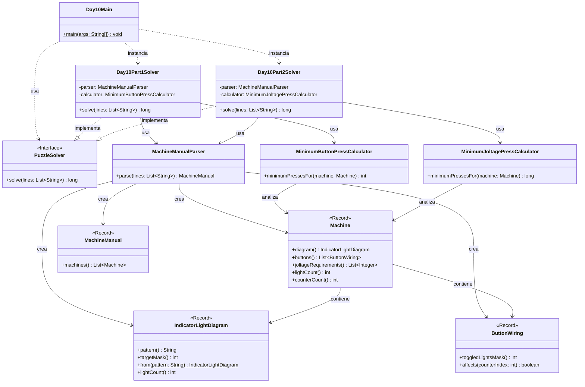

# Advent of Code 2025 - Day 10: Factory

Este proyecto contiene la solución para el **Día 10** del Advent of Code 2025: **Factory**.

El problema consiste en analizar una lista de máquinas. Cada máquina aparece descrita en una línea del manual e incluye:

* un diagrama de luces indicadoras;
* una lista de botones y los índices que afectan;
* una lista de requisitos de joltage.

El día está dividido en dos partes:

* **Parte 1**: calcular el mínimo número de pulsaciones necesarias para configurar las luces indicadoras.
* **Parte 2**: calcular el mínimo número de pulsaciones necesarias para alcanzar exactamente los requisitos de joltage.

---

## Descripción del problema

Cada línea del input describe una máquina.

Ejemplo:

```text
[.##.] (3) (1,3) (2) (2,3) (0,2) (0,1) {3,5,4,7}
```

La línea contiene tres tipos de información:

```text
[.##.]              → diagrama de luces indicadoras
(3) (1,3) ...       → botones y elementos que afectan
{3,5,4,7}           → requisitos de joltage
```

---

## Parte 1

En la primera parte solo importan:

* el diagrama de luces;
* los botones.

Los requisitos de joltage se ignoran.

Cada luz empieza apagada. El objetivo es conseguir que las luces coincidan con el diagrama.

En el diagrama:

```text
. → luz apagada
# → luz encendida
```

Por ejemplo:

```text
[.##.]
```

significa que hay cuatro luces y el estado objetivo es:

```text
luz 0 → apagada
luz 1 → encendida
luz 2 → encendida
luz 3 → apagada
```

Cada botón alterna el estado de las luces indicadas.

Por ejemplo:

```text
(0,3)
```

al pulsarse cambia el estado de las luces `0` y `3`.

Si una luz estaba apagada, pasa a encendida.
Si una luz estaba encendida, pasa a apagada.

La pregunta de la parte 1 es:

```text
¿Cuál es el menor número total de pulsaciones necesarias para configurar todas las máquinas?
```

Con el ejemplo oficial:

```text
[.##.] (3) (1,3) (2) (2,3) (0,2) (0,1) {3,5,4,7}
[...#.] (0,2,3,4) (2,3) (0,4) (0,1,2) (1,2,3,4) {7,5,12,7,2}
[.###.#] (0,1,2,3,4) (0,3,4) (0,1,2,4,5) (1,2) {10,11,11,5,10,5}
```

el resultado es:

```text
7
```

Con el input real del usuario, el resultado de la parte 1 es:

```text
498
```

---

## Parte 2

En la segunda parte se ignoran las luces indicadoras.

Ahora importan:

* los botones;
* los requisitos de joltage.

Cada máquina tiene varios contadores de joltage, todos inicialmente a `0`.

Un requisito como:

```text
{3,5,4,7}
```

significa que la máquina tiene cuatro contadores y el objetivo es alcanzar exactamente:

```text
contador 0 → 3
contador 1 → 5
contador 2 → 4
contador 3 → 7
```

Los botones ya no alternan luces. En esta parte, cada botón incrementa en `1` los contadores indicados.

Por ejemplo:

```text
(1,3)
```

incrementa el contador `1` y el contador `3`.

Si el estado actual fuera:

```text
{0,1,2,3}
```

después de pulsar `(1,3)` quedaría:

```text
{0,2,2,4}
```

La pregunta de la parte 2 es:

```text
¿Cuál es el menor número total de pulsaciones necesarias para alcanzar exactamente los requisitos de joltage de todas las máquinas?
```

Con el ejemplo oficial, el resultado es:

```text
33
```

Con el input real del usuario, el resultado de la parte 2 es:

```text
17133
```

---

## Diseño y arquitectura

La solución mantiene la estructura modular usada en los días anteriores:

```text
day10
├── Day10Main.java
├── common
├── part1
└── part2
```

La parte común contiene el modelo y el parser del manual.

La parte 1 y la parte 2 tienen calculadoras separadas porque resuelven problemas diferentes:

```text
Parte 1 → luces, toggles, XOR, cada botón se pulsa 0 o 1 vez en la solución óptima
Parte 2 → contadores, sumas, cada botón puede pulsarse muchas veces
```

Por tanto, no se modifica la clase de la parte 1 para resolver la parte 2. Se crea una clase nueva específica.

---

## Decisión de diseño tras añadir la parte 2

En la parte 1 se creó:

```text
MinimumButtonPressCalculator
```

Esta clase resuelve el problema de las luces mediante máscaras de bits y programación dinámica.

En la parte 2 se añade:

```text
MinimumJoltagePressCalculator
```

Esta clase resuelve el problema de los contadores de joltage.

La parte 2 no es una pequeña modificación de la parte 1, porque cambia completamente la semántica de los botones:

```text
Parte 1:
pulsar un botón alterna bits

Parte 2:
pulsar un botón incrementa contadores
```

Por eso se crea una clase específica en `part2`.

Los cambios pequeños y reutilizables sí se añaden en `common`, por ejemplo:

```text
ButtonWiring.affects(...)
Machine.counterCount()
```

---

## Principios aplicados

### Single Responsibility Principle, SRP

Cada clase tiene una única responsabilidad:

* `Day10Main`: ejecuta el día 10 y muestra los resultados.
* `IndicatorLightDiagram`: representa el patrón objetivo de luces.
* `ButtonWiring`: representa los índices afectados por un botón.
* `Machine`: representa una máquina del manual.
* `MachineManual`: representa el conjunto de máquinas.
* `MachineManualParser`: convierte el input textual en objetos del dominio.
* `MinimumButtonPressCalculator`: calcula el mínimo de pulsaciones para luces.
* `MinimumJoltagePressCalculator`: calcula el mínimo de pulsaciones para joltage.
* `Day10Part1Solver`: resuelve únicamente la parte 1.
* `Day10Part2Solver`: resuelve únicamente la parte 2.

---

### Open/Closed Principle, OCP

La parte 2 se añade sin modificar la lógica específica de la parte 1.

La clase de la parte 1 permanece estable:

```text
MinimumButtonPressCalculator
```

La parte 2 introduce una nueva clase:

```text
MinimumJoltagePressCalculator
```

Así, el código existente queda cerrado a modificaciones innecesarias, pero el sistema sigue abierto a extensión.

---

### Dependency Inversion Principle, DIP

Los solvers implementan la interfaz común:

```java
PuzzleSolver
```

Esto permite tratarlos de forma uniforme desde el `Main`:

```java
PuzzleSolver part1Solver = new Day10Part1Solver();
PuzzleSolver part2Solver = new Day10Part2Solver();
```

El punto de entrada no necesita conocer los detalles internos de cada algoritmo.

---

### DRY

El parser y el modelo se comparten entre ambas partes:

```text
IndicatorLightDiagram
ButtonWiring
Machine
MachineManual
MachineManualParser
```

Esto evita duplicar código de parsing o representación de máquinas.

La lógica específica se mantiene separada:

```text
MinimumButtonPressCalculator  → parte 1
MinimumJoltagePressCalculator → parte 2
```

---

## Estructura del proyecto

```text
src
├── main
│   ├── java
│   │   └── es
│   │       └── ulpgc
│   │           └── aoc2025
│   │               ├── common
│   │               │   └── PuzzleSolver.java
│   │               │
│   │               └── day10
│   │                   ├── Day10Main.java
│   │                   │
│   │                   ├── common
│   │                   │   ├── ButtonWiring.java
│   │                   │   ├── IndicatorLightDiagram.java
│   │                   │   ├── Machine.java
│   │                   │   ├── MachineManual.java
│   │                   │   └── MachineManualParser.java
│   │                   │
│   │                   ├── part1
│   │                   │   ├── Day10Part1Solver.java
│   │                   │   └── MinimumButtonPressCalculator.java
│   │                   │
│   │                   └── part2
│   │                       ├── Day10Part2Solver.java
│   │                       └── MinimumJoltagePressCalculator.java
│   │
│   └── resources
│       └── day10
│           └── input.txt
│
└── test
    └── java
        └── es
            └── ulpgc
                └── aoc2025
                    └── day10
                        ├── part1
                        │   └── Day10Part1SolverTest.java
                        └── part2
                            └── Day10Part2SolverTest.java
```

---

## Paquetes principales

### `es.ulpgc.aoc2025.common`

Contiene código común a todo el proyecto Advent of Code.

Actualmente contiene:

```text
PuzzleSolver.java
```

Esta interfaz define el contrato común de todos los solvers:

```java
long solve(List<String> lines);
```

---

### `es.ulpgc.aoc2025.day10`

Contiene el punto de entrada específico del día 10:

```text
Day10Main.java
```

Esta clase se encarga de:

1. leer el archivo de entrada;
2. crear el solver de la parte 1;
3. crear el solver de la parte 2;
4. ejecutar ambos solvers;
5. mostrar los resultados por consola.

---

### `es.ulpgc.aoc2025.day10.common`

Contiene las clases comunes del dominio del día 10.

Estas clases se reutilizan en ambas partes.

---

### `es.ulpgc.aoc2025.day10.part1`

Contiene la solución específica de la primera parte.

---

### `es.ulpgc.aoc2025.day10.part2`

Contiene la solución específica de la segunda parte.

---

## Clases principales

### `IndicatorLightDiagram`

Representa el diagrama de luces indicadoras.

```java
package es.ulpgc.aoc2025.day10.common;

public record IndicatorLightDiagram(String pattern, int targetMask) {

    public IndicatorLightDiagram {
        if (pattern == null) {
            throw new IllegalArgumentException("Pattern cannot be null");
        }

        if (pattern.isEmpty()) {
            throw new IllegalArgumentException("Pattern cannot be empty");
        }

        if (!pattern.matches("[.#]+")) {
            throw new IllegalArgumentException("Pattern can only contain '.' and '#'");
        }

        if (targetMask < 0) {
            throw new IllegalArgumentException("Target mask cannot be negative");
        }
    }

    public static IndicatorLightDiagram from(String pattern) {
        int targetMask = 0;

        for (int light = 0; light < pattern.length(); light++) {
            if (pattern.charAt(light) == '#') {
                targetMask |= 1 << light;
            }
        }

        return new IndicatorLightDiagram(pattern, targetMask);
    }

    public int lightCount() {
        return pattern.length();
    }
}
```

Responsabilidades:

* almacenar el patrón de luces;
* validar el formato;
* convertir el patrón objetivo en una máscara de bits.

---

### `ButtonWiring`

Representa los índices afectados por un botón.

```java
package es.ulpgc.aoc2025.day10.common;

public record ButtonWiring(int toggledLightsMask) {

    public ButtonWiring {
        if (toggledLightsMask < 0) {
            throw new IllegalArgumentException("Toggled lights mask cannot be negative");
        }
    }

    // Añadido para parte 2.
    // En modo joltage, la misma máscara indica qué contadores incrementa el botón.
    public boolean affects(int counterIndex) {
        return (toggledLightsMask & (1 << counterIndex)) != 0;
    }
}
```

Responsabilidades:

* almacenar la máscara de índices afectados;
* permitir consultar si afecta a un contador o luz concreta.

---

### `Machine`

Representa una máquina del manual.

```java
package es.ulpgc.aoc2025.day10.common;

import java.util.List;

public record Machine(
        IndicatorLightDiagram diagram,
        List<ButtonWiring> buttons,
        List<Integer> joltageRequirements
) {

    public Machine {
        if (diagram == null) {
            throw new IllegalArgumentException("Diagram cannot be null");
        }

        if (buttons == null) {
            throw new IllegalArgumentException("Buttons cannot be null");
        }

        if (buttons.isEmpty()) {
            throw new IllegalArgumentException("A machine must contain at least one button");
        }

        if (joltageRequirements == null) {
            throw new IllegalArgumentException("Joltage requirements cannot be null");
        }

        buttons = List.copyOf(buttons);
        joltageRequirements = List.copyOf(joltageRequirements);
    }

    public int lightCount() {
        return diagram.lightCount();
    }

    // Añadido para parte 2.
    // En modo joltage, cada requisito representa un contador.
    public int counterCount() {
        return joltageRequirements.size();
    }
}
```

Responsabilidades:

* almacenar el diagrama de luces;
* almacenar los botones;
* almacenar los requisitos de joltage;
* exponer información útil para ambas partes.

---

### `MachineManual`

Representa el conjunto de máquinas del input.

```java
package es.ulpgc.aoc2025.day10.common;

import java.util.List;

public record MachineManual(List<Machine> machines) {

    public MachineManual {
        if (machines == null) {
            throw new IllegalArgumentException("Machines cannot be null");
        }

        if (machines.isEmpty()) {
            throw new IllegalArgumentException("Manual must contain at least one machine");
        }

        machines = List.copyOf(machines);
    }
}
```

Responsabilidades:

* almacenar todas las máquinas;
* validar que el manual no esté vacío.

---

### `MachineManualParser`

Convierte las líneas del input en un `MachineManual`.

Responsabilidades:

* extraer el diagrama entre corchetes;
* extraer los botones entre paréntesis;
* extraer los requisitos de joltage entre llaves;
* construir los objetos del dominio.

---

### `MinimumButtonPressCalculator`

Resuelve la lógica de la parte 1.

Su algoritmo es:

1. convertir el estado objetivo de luces en una máscara;
2. convertir cada botón en una máscara;
3. aplicar programación dinámica sobre estados;
4. buscar el menor número de botones que produce el estado objetivo.

En la parte 1, pulsar dos veces un botón equivale a no haberlo pulsado, pero con más coste. Por eso, en una solución óptima, cada botón se pulsa como máximo una vez.

---

### `MinimumJoltagePressCalculator`

Resuelve la lógica de la parte 2.

Su algoritmo es:

1. construir un sistema lineal a partir de botones y requisitos;
2. interpretar cada variable como el número de veces que se pulsa un botón;
3. buscar una solución entera no negativa;
4. minimizar la suma de pulsaciones.

El sistema tiene la forma:

```text
A * x = b
```

donde:

```text
A → matriz de botones y contadores afectados
x → número de pulsaciones de cada botón
b → requisitos de joltage
```

---

## Estrategia de resolución

### Parte 1: luces y máscaras de bits

Cada luz se representa como un bit.

Ejemplo:

```text
[#..#]
```

se interpreta como:

```text
luz 0 → 1
luz 1 → 0
luz 2 → 0
luz 3 → 1
```

Cada botón también se convierte en una máscara.

Pulsar un botón se modela con XOR:

```java
int nextState = state ^ button.toggledLightsMask();
```

Se usa programación dinámica para calcular el mínimo número de pulsaciones necesario para llegar a cada estado posible.

Si una máquina tiene `n` luces, hay:

```text
2^n
```

estados posibles.

---

### Parte 2: contadores de joltage

En la parte 2 no hay toggles.

Cada botón incrementa en `1` ciertos contadores.

Por tanto, el problema se transforma en buscar cuántas veces se debe pulsar cada botón para alcanzar los requisitos.

Ejemplo:

```text
botón A afecta a contadores 0 y 2
botón B afecta a contadores 1 y 2
objetivo {3,5,4}
```

El sistema sería:

```text
A + 0 = 3
0 + B = 5
A + B = 4
```

En el código general, esto se representa como una matriz.

---

## Diagrama de arquitectura



---

## Entrada del programa

El archivo de entrada debe colocarse en:

```text
src/main/resources/day10/input.txt
```

El formato debe ser:

```text
[diagrama] (botón) (botón) ... {requisitos}
```

Ejemplo:

```text
[.##.] (3) (1,3) (2) (2,3) (0,2) (0,1) {3,5,4,7}
```

---

## Ejecución en IntelliJ IDEA

Para ejecutar el día 10:

1. abrir el archivo:

```text
src/main/java/es/ulpgc/aoc2025/day10/Day10Main.java
```

2. pulsar el botón verde junto al método `main`;

3. seleccionar:

```text
Run 'Day10Main.main()'
```

La salida tendrá este formato:

```text
Day 10 - Part 1: 498
Day 10 - Part 2: 17133
```

---

## Ejecución con Maven

Para ejecutar los tests:

```bash
mvn test
```

---

## Tests

El proyecto incluye tests separados para cada parte:

```text
Day10Part1SolverTest.java
Day10Part2SolverTest.java
```

Ambos tests usan el ejemplo oficial:

```text
[.##.] (3) (1,3) (2) (2,3) (0,2) (0,1) {3,5,4,7}
[...#.] (0,2,3,4) (2,3) (0,4) (0,1,2) (1,2,3,4) {7,5,12,7,2}
[.###.#] (0,1,2,3,4) (0,3,4) (0,1,2,4,5) (1,2) {10,11,11,5,10,5}
```

Resultado esperado para la parte 1:

```text
7
```

Resultado esperado para la parte 2:

```text
33
```

---

## Rendimiento

La parte 1 es eficiente porque trabaja con estados de bits.

Si una máquina tiene `n` luces, el número de estados es:

```text
2^n
```

En los inputs del problema, el número de luces por máquina es pequeño, por lo que esta estrategia es adecuada.

La parte 2 trabaja con sistemas lineales pequeños, ya que cada máquina tiene un número reducido de contadores y botones.

---

## Convención para próximos días

Cada día del Advent of Code seguirá la misma estructura:

```text
dayXX
├── DayXXMain.java
├── common
├── part1
└── part2
```

Ejemplo para el día 11:

```text
day11
├── Day11Main.java
├── common
├── part1
└── part2
```

Cuando una clase pueda compartirse sin modificar su comportamiento, se coloca en `common`.

Cuando una parte requiera modificar mucho el comportamiento de una clase existente, se crea una clase específica dentro de `part1` o `part2`.

Cuando el cambio sea pequeño y coherente con la responsabilidad de la clase, se añade directamente a la clase común y se marca con un comentario.

En este día:

```text
IndicatorLightDiagram → common
ButtonWiring → common
Machine → common
MachineManual → common
MachineManualParser → common
MinimumButtonPressCalculator → específico de part1
MinimumJoltagePressCalculator → específico de part2
```

---

## Conclusión

La solución del día 10 separa claramente dos problemas distintos.

La parte 1 configura luces usando operaciones de toggle, por lo que se resuelve con máscaras de bits y programación dinámica.

La parte 2 configura contadores de joltage usando incrementos acumulativos, por lo que se modela como un sistema de ecuaciones enteras no negativas.

El diseño evita modificar la clase de la parte 1 para adaptarla a la parte 2. En su lugar, se crea una calculadora específica para joltage, manteniendo el código modular, expresivo y preparado para seguir creciendo.
